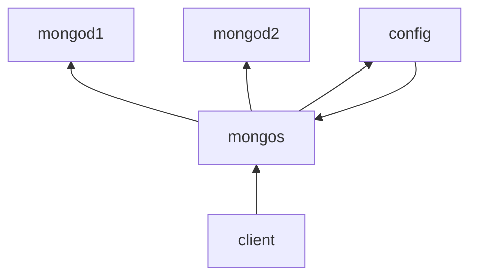

# 分片

分片(sharding)是指将数据库拆分，把数据分散到不同机器上。

设置分片时，需要从集合里面选一个键，用该键作为数据拆分的依据。这个键称为片键(shard key)

分片后和mongos交互，不直接与mongod交互。数据和片的对应关系以及相应的配置信息保存在config服务器上




## 1. 搭建过程

开启config服务器

```shell
mongod --dbpath xxx --port 27010
```

开启mongos服务器，需要指定config服务器

```shell
mongos --port 27011 --configdb=192.168.94.151:27010
```

启动mongod服务器

```shell
mongod --dbpath xxxx --port 27012
mongod --dbpath xxxx --port 27013
```

服务器配置

client连接mongos，然后添加mongod到mongos

```shell
mongo 27011
db.runCommand({'addshard':"192.168.94.151:27012",allowLocal:true})
db.runCommand({'addshard':"192.168.94.151:27013",allowLocal:true})
```

开启数据库分片功能，

```shell
db.runCommand({'enablesharding':'test'}）
```

指定集合中分片的片键

```
db.runCommand({'shardcollection':'test.user','key':{'name':1}})
```

查看分片情况

```
db.printShardingStatus()
```

