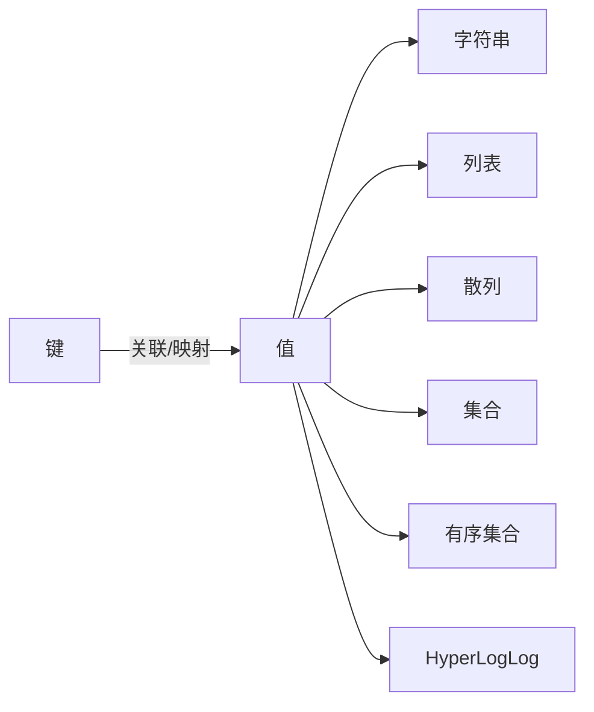

#  redis介绍

很多数据库只能处理一种数据结构：

- sql数据库-表格
- Memcached-键值对数据库，键和值都是字符串
- 文档数据库MongoDB\CouchDB-由JSON/BJSON组成的文档

而一旦数据库提供的数据结构不适合去做某件事的话，程序写起来就会非常麻烦和不自然。

Redis也是键值对数据库，但和Memcached不同的是，Redis的值不仅可以是字符串，还可以是其它五中数据库结构中的任意一种。

通过选用不同的数据结构，用户可以使用Redis解决各式各样的问题

功能特性：

1. 内存数据库
2. 持久化功能：将存在内存里的数据保存到硬盘里面，保障数据安全，方便进行数据备份与恢复
3. 发布订阅功能：将消息同时分发给多个客户端，用于构建广播系统
4. 过期功能：为键设置一个过期时间，让它在指定的时间之后被删除
5. 事物功能：原子地执行多个操作，并提供乐观锁功能，保证处理数据时的安全性
6. lua脚本功能：在服务器端原子地执行多个操作，完成复杂的功能，并减少客户端与服务器之间的通信往返次数
7. 主从：为指定的redis服务器创建一个或多个复制品，用于提升数据安全性，并分担读的请求负载
8. Sentinel哨兵：监控redis服务器状态，并在服务器发生故障时，进行自动故障转移
9. 集群：创建分布式数据库，每个服务器分别执行一部分写操作和读操作 

使用案例：

1. Twitter使用redis来存储用户的时间线

2. StackOverflow使用redis来进行缓存和消息开发

3. Pinterest使用Redis来构建关注模型follow model和兴趣图谱interest graph

4. Flickr使用Redis来构建队列

5. Github使用Redis作为持久化的键值对数据库，并使用Resque来实现消息队列

6. 新浪微博使用Redis来时间计数器、反向索引、排行榜、消息队列，并存储用户关系

7. 知乎使用Redis来进行计数、缓存、消息分发和任务调度
