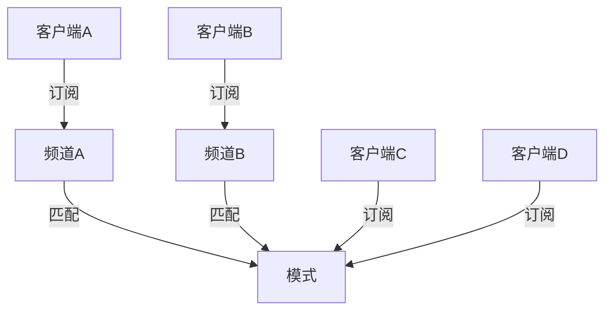

# 发布与订阅

## 1. 介绍

可以同时将消息发送给多个客户端。

发布者（publisher）：发布消息的客户端

频道(channel)：构建在服务器内部，负责接收发布者发送的消息，并将消息转发给频道的订阅者

模式（pattern）：构建在服务器内部，负责对频道进行匹配，当被匹配的频道接收消息时，模式也会将消息转发给模式的订阅者

订阅者(subscriber)：通过订阅频道或者模式来获取消息的客户端，每个频道或者模式都可以有任意多个订阅者。



## 2 subscribe订阅频道

```shell
subscribe channel [channel ...]
```

订阅给定的一个或多个频道，复杂度O(N),N为被定于频道的数量

```
127.0.0.1:6379> subscribe news::it
subscribe    -- 订阅频道时返回的信息
news::it     -- 订阅的频道
1            -- 订阅的数量
message      -- 接收到消息
news::it	 -- 频道
aaa			 -- 内容

```


## 3. PSUBSCRIBE订阅模式

```shell
PSUBSCRIBE pattern [pattern ...]
```

订阅一个或多个模式，pattern参数可以包含glob风格的匹配符。

- new::*，可以匹配new::开头的配到
- new::[ie]t 可以匹配new::it new::et 
- new::?t 可以匹配new::开头t结尾的频道。

命令复杂度为O(N),N为被订阅模式的数量

```shell
127.0.0.1:6379> PSUBSCRIBE new::[ie]t
psubscribe  -- 订阅模式时返回的信息
new::[ie]t  -- 订阅的模式
1			-- 客户端目前订阅的数量

pmessage    -- 接收到消息
news::[ie]t -- 匹配的模式
news::it    -- 匹配到的模式
aaa         -- 内容

```

## 4. 退订频道和模式

| 命令                                 | 作用                                                         | 复杂度                           |
| ------------------------------------ | ------------------------------------------------------------ | -------------------------------- |
| unsubscribe [channel [channel ...]]  | 退订指定频道，如果指定时没有指定任何频道，那么退订已订阅的所有频道 | O(N),N为被退订的频道数量         |
| punsubscribe [pattern [pattern ...]] | 退订指定模式，如果执行时没有指定任何模式，那么退订已订阅的所有模式 | O(N),N为服务器中被订阅模式的数量 |

## 5. publish发布消息

```shell
publish channel message

127.0.0.1:6379> publish news::it aaa
2

```

将消息发送到指定的频道，命令返回接收到消息的订阅者数量

复杂度为O(N),N为接收到消息的订阅者的数量，包括通过订阅频道来接收消息的订阅者和通过订阅频道来接收消息的订阅者

## 6. pubsub查看被订阅的频道

```shell
pubsub channels [pattern]
```

列出目前至少有一个订阅者的频道

如果给定了可选的pattern参数，那么只列出与模式匹配的频道

复杂度为O(N),N为服务器中被订阅频道的总数量

```shell
127.0.0.1:6379> pubsub channels
news::et
news::it
127.0.0.1:6379> pubsub channels news::[ie]t
news::et
news::it
127.0.0.1:6379> pubsub channels news::[i]t
news::it
```

## 7. 查看频道的订阅者的数量

```shell
pubsub numsub [channel ...]

127.0.0.1:6379> pubsub numsub news::it news::et
news::it
1
news::et
1
```

返回给定频道的订阅者数量。

复杂度O(N),N为给定频道的数量。

## 8. 查看被订阅模式的数量

```shell
 pubsub numpat
```

返回服务器目前被订阅的模式的数量，复杂度为O(1)

## 9. 示例

- 直播间，播主发消息到频道，听众订阅频道

## 