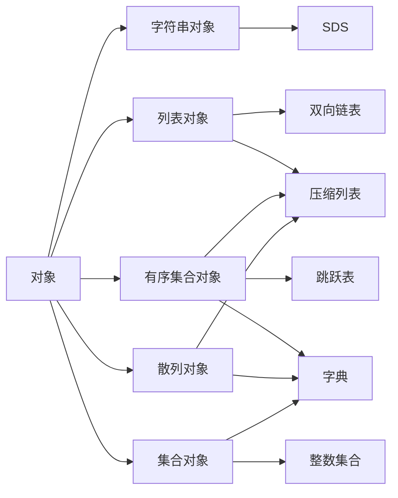

# redis实现原理简介

## 1. 对象系统

redis是一个键值对数据库，数据库中每个键都有与之对应的值，并且这些键和值都是对象（object），其中：

- 键总是一个字符串对象（String Object）
- 值可以是字符串对象、列表对象、散列对象、集合对象或者有序集合对象中的任意一个

## 2. 对象的实现

redis中的每种对象都有与之相对应的底层数据结构，并且为了让对象在各种不同的应用场景下都有优秀的性能表现，redis为每种对象都提供了两种类型的数据结构实现。

- 第一类是为了进行性能优化而特制的编码数据结构，这些数据结构主要使用以cpu换内存的方式来节约内存。编码数据结构主要在对象包含的值数量比较少，或者值体积比较小时使用：比如在字符串对象包含的字符串比较短时，集合只包含三五个小元素时，又或者列表只包含十来个项时，这些情况都可以使用编码数据结构。
- 另一类是普通数据结构，也即是我们看见的数据结构，比如双线链表、字典、跳跃表等。这种普通的数据结构需要消耗更多的内存，但是能提供强大的功能，普通数据结构主要在对象包含的值比较多、或者值体积比较大时使用。

在创建新对象时，redis会优先使用编码数据结构来表示对象，并在有需要时，自动将对象的表示方式转为普通数据结构。

## 3. 数据结构

编码数据结构：

- 压缩列表
- 整数集合

普通数据结构：

- 简单动态字符串（SDS, simple synamic string）
- 双向链表
- 字典
- 跳跃表

## 4. 对象与数据结构之间的关系

## 5. 压缩列表

压缩列表具有以下特点:

- 压缩列表包含的项都是有序的,列表的两端分别为表头和表尾。
- 每个项可以储存一个字符串、整数或者浮点数。
- 可以从表头开始或者从表尾开始遍 历整个压缩列表,复杂度为 O(N) 。
- 定位压缩列表中指定索引上的 项,复杂度为 O(N) 。
- 使用压缩列表来储存值消耗的内存比使用双向 链表来储存值消耗的内存要少。

## 6. 整数集合

整数集合具有以下特点:
- 集合元素只能是整数(最大 为 64 位),并且集合中不会出 现重复的元素。
- 集合的底层使用有序的整数数 组来表示。
- 数组的类型会随着新添加元素的 类型而改变:举个例子,如果 集合中位长度最大的元素 可以使用
  16 位整数来保存,那么数 组的类型就是 int16_t ,而如果集合中位 长度最大的元素可以使用 32 位
  整数来保存的 话,那么数组的类型就是 int32_t ,诸如此类。
- 数组的类型只会自动增大,但不会减小。

## 7. SDS

Redis 使用 SDS (simple dynamic string)而不是 C 语言的字符串格式(以空字符 为结尾的字符数组)来
作为 Redis 的默认字符串表示, SDS 具有以下特点:
- 可以储存位数组(实现 BITOP 和 HyperLogLog)、字符串、整数和浮点数,其中超 过 64 位的整数
  和超过 IEEE 754 标准的浮点数使用字符串来表示。
- 具有 int 、 embstr 和 raw 三种表示形式可 选,其中 int 表示用于储存小于等于 64 位的整数,
  embstr 用来储存比较短的位数组和字符串,而其他格式的 值则由 raw 格式储存。
- 比起 C 语言的字符串格式, SDS 具有以下四个 优点: 1)常数复杂度获取长度值; 2)不会引起缓冲
  区溢出; 3)通过预分配和惰性释放两种策略来减少内存重分配的 执行次数; 4)可以储存二进制
  位。

## 8. 双向链表

Redis 的双向链表实现具有以下特性:
- 双向、无环、带有表头和表尾指针。
- 一个链表包含多个项,每个项都是一个字符串 对象,换句话来说,一个列表对象可以包含多个字符
  串对象。
- 可以从表头或者表尾遍历整个链表,复杂度为 O(N) 。
- 定位特定索引上的 项,复杂度为 O(N) 。
- 链表带有长度记录属性,获取链表的当前长度的复杂度为 O(1) 。

## 9. 字典

Redis 的字典实现具有以下特性:
- 查找、添加、删除键值对的复杂度为 O(1) ,键和值都是字符串对象。
- 使用散列表(hash table)为底层实现,使用链地址法(separate chaining)来解决键冲突。
- Redis 会在不同的地方使用不同的散列算法,其中最常用的是 MurmurHash2 算法。
- 在键值对数量大增或者大减的 时候会对散列表进行重新散列(rehash),并且这个 rehash 是渐进
  式、分多次进行的,不会在短 时间内耗费大量 CPU 时间,造成服务器阻塞。

## 10. 跳跃表

Redis 的跳跃表实现具有以下特点:
- 支持平均 O(log N) 最坏 O(N) 复杂度的节点查找操作,并且可以通 过执行范围性(range)操作来批量地获取有序的节点。
- 跳跃表节点除了实现跳跃表所需的层(level)之外,还具有 score 属性和 obj 属性:前者是一个浮点数,用于 记录成员的分值;而后者则是一个字符串对象,用来记录成员本身。
- 和字典一起构成 ZSET 结构,用于实现 Redis的有序集合结构:其中字典用于快速 获取元素的分值(比如实现 ZSCORE 命令),以及判断元素是否存在;而跳 跃表则用于执行范围操作(比如实现 ZRANGE 命令)。

##  11. 记录过期时间

为了记录数据库键的过期时间,Redis 为每个数据库创建了另一个字典, 专门使用这个字典来记录键的过期时间,其中:
- 字典的键指向数据库键对象,也即是带有过期时间的那个键(数据库字典和储存过期时间的字典通
  过指针使用同一个键对象,不会造成任何 资源浪费)。
- 键的值则是一个毫秒格式的 UNIX 时间戳,记录了键到期的时间。

## 12. RDB 持久化实现原理

Redis 会遍历服务器中的所有数据 库,访问数据库中的所有键值对,并根据键值对的类型,将这些键值对以及它们的过期时间写入到 RDB 文件里面。

## 13. AOF 持久化实现原理

AOF 持久化功能在每次 执行命令之后就将 协议格式的命令写入到 AOF 缓冲区,然后服 务器再定期将缓冲区的内容写入到 AOF 文件,还原数据时只要重新执行 AOF 文件里面的命令即可。

## 14. AOF 文件重写的实现原理

无须对现有的 AOF 文件进行处理,直接根据数据 库目前的状态来生成新的 AOF 文件。

## 15. 命令处理模型

Redis 服务器使用 Reactor 模式来连接多个客户端并处理命令请求,其中:
- 客户端发送的命令请求会被放到一个有序的 队列里面。
- 服务器使用单线程方式来执行命令 —— 服务器每次从队列里面取出一个 请求并处理它,只有在当前的命令请求处理完毕之后,服务器才会去处理下一个命令 请求。
- 单线程的命令处理方式使得针对服务器以及数据库的操作都不需要加 锁,好处是极大地方便了功能的实现,减少了代码出错的可能性;而坏 处则是不能最大化地使用硬件的多 线程能力。