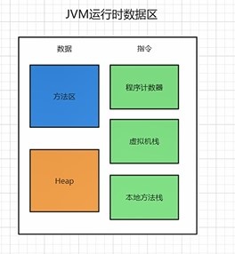
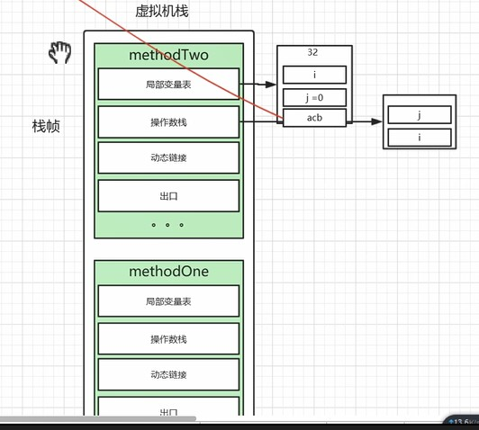
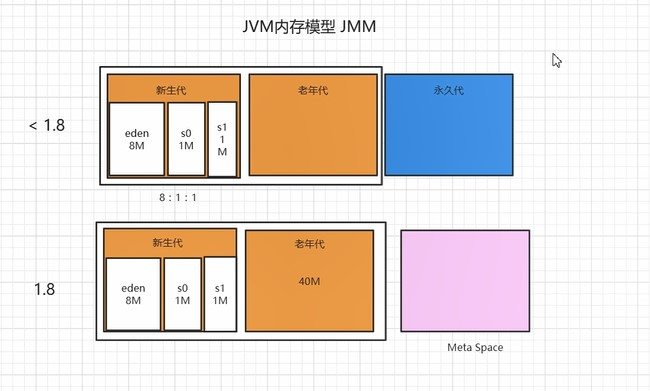

## 1. 介绍

1. 软件层面机器码翻译
2. 内存管理

## 2. 程序计数器

指向当前线程正在执行的字节码指令的地址   行号

## 3. 虚拟机栈

存储当前线程运行方法所需的数据、指令、返回地址

## 4. 方法区

类信息、常量(1.7)、静态变量、JIT

## 5. HEAP

## 6. 内存模型

因为变量生命周期不一样，所以用分代形势划分了整个堆

### 6.1 新生代

### 6.2 老年代

### 6.3 永久代

### 6.4 Meta Space

## 7. 什么样的对象需要被GC

判断算法：

​	引用计数法：互相引用造成无法回收

​	可达性分析：GC Root   ->组成

​		虚拟机栈中本地变量表引用的对象

​		方法区中

​			类静态变量引用的对象

​			常量引用的对象

​		本地方法栈中JNI引用的对象

​	不可达是不是就一定被回收

​		finalize()里面可以做挽救，可达一下，但不一定成功