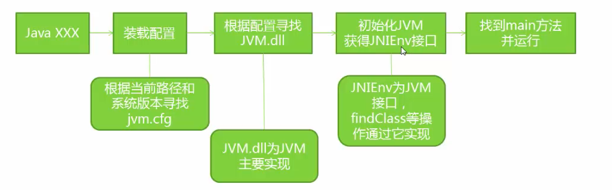
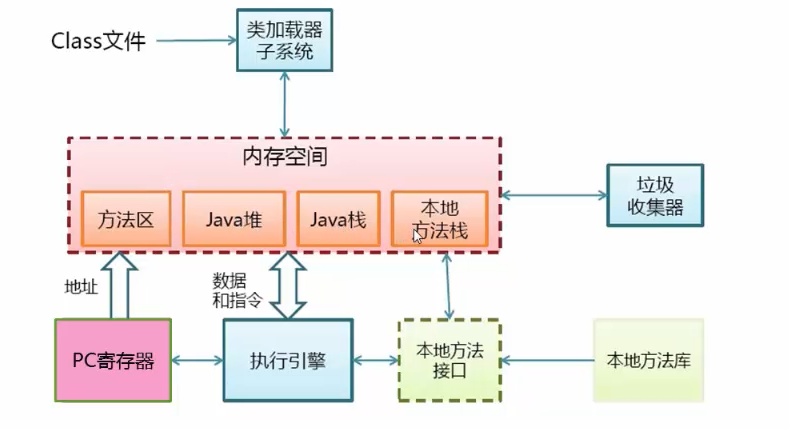
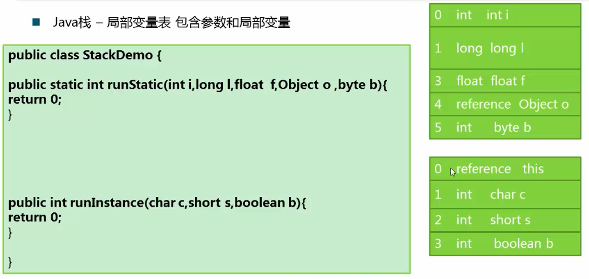
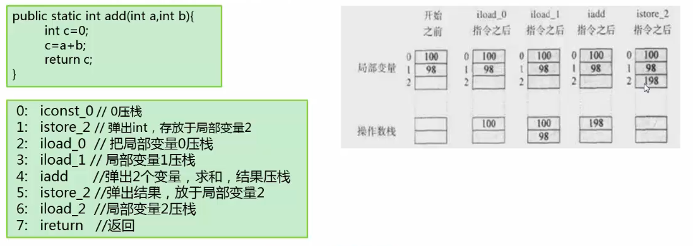
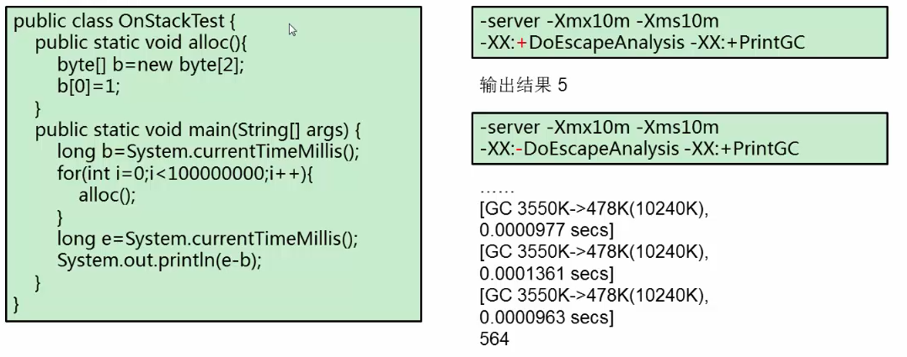
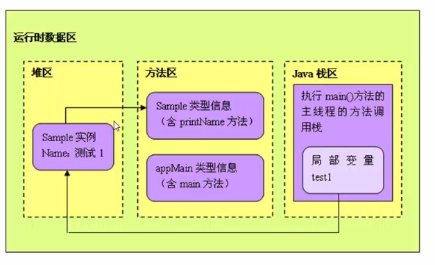
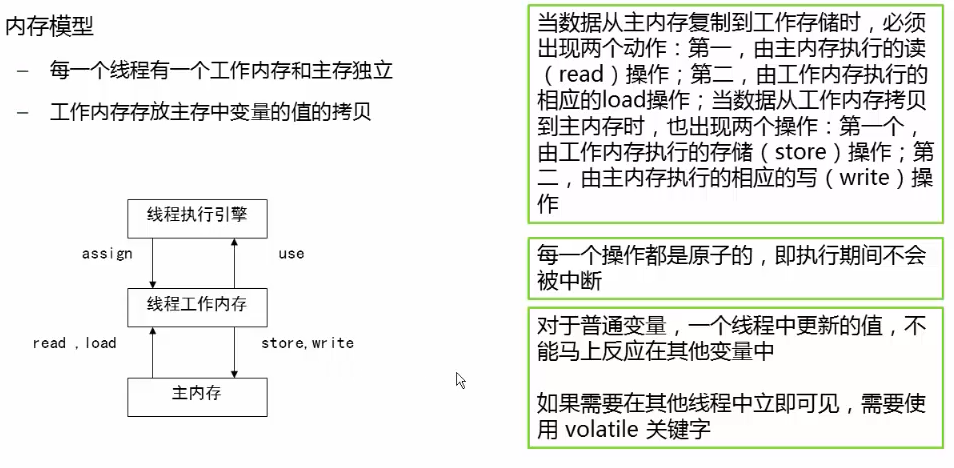

## 1. jvm启动流程

## 2. jvm基本结构

PC寄存器（程序计数器）

- 每个线程拥有一个PC寄存器
- 在线程创建是创建
- 指向下一条指令的地址
- 执行本地方法时，PC的值为undefined

方法区

- 保存装在类信息

  - 类型的常量池

    - 字段、方法信息

    - 方法字节码

- 通常和永久代（Perm）关联在一起

堆

- 应用系统对象都保存在堆中
- 所有线程共享java堆
- 对与分代GC来说，堆也是分代的
- 新生代eden s0 s1  老年代

java栈

- 线程私有

- 栈由一些列栈帧组成

- 栈帧保存一个方法的局部变量（方法参数和局部变量）、操作数栈、常量池指针、返回地址等

  

  ​     实例方法先入栈自己的实例引用

- 每一次方法调用一个栈帧，并压栈

- 操作数栈：

  - java中没有寄存器，所有参数传递使用操作数栈

    

- 栈上分配

  - 堆上分配，每次需要清理空间
  - 栈上分配，函数调用完自动清理

  

  ​	数据不是太大的时候，虚拟机会进行优化：

  ​	第一次是栈上分配，不需要gc，运行也快

  ​	第二次是堆上分配，需要gc，运行慢

  - 小对象（一般是几十个bytes），在没有逃逸（可能多个线程共用）的情况下，可以直接分配在栈上
  - 直接分配在栈上可自动回收，减轻gc压力
  - 大对象或者逃逸对象无法栈上分配

- 堆、栈、方法区交互

  

## 3. 内存模型

- 每一个线程有一个工作内存和主存（可以理解为堆空间）独立
- 工作内存存放着主存中变量的值拷贝 

 

可见性

​	一个线程修改了变量，其它线程可以立即知道

保证可见性的方法

 - volatile
 - synchronized(unlock之前，写变量值i回主存)
 - final(一旦初始化完成，其它线程可见)	

有序性

​	在本线程内，操作都是有序的

​	在线程外观察，操作都是无序的（指令重排或主内存同步延时）

happen-before原则：指令重排基本原则

 - 程序顺序原则：一个线程内保证语义的串行性
 - volatile规则：volatile变量的写，先发生于读
 - 锁规则：解锁（unlock）必然发生在随后加锁（lock）前
 - 传递性：A先于B，B先于C，那么A必然先于C
 - 线程的start方法，先于它的每个动作
 - 线程的所有操作先于线程的终结（Thread.join()）
 - 线程的中断（interrupt()）先于被中断线程的代码
 - 对象的构造函数执行结束先于finalize()方法

## 4. 编译和解释运行的概念

解释执行

- 解释执行以解释方式运行字节码
- 解释执行的意思是：读一句执行一句

编译执行（JIT）

- 将字节码编译成机器码
- 直接执行机器码
- 运行时编译
- 编译后性能有数量级的提升

## 5. 作业

你能想到有什么办法，可以让一个程序的函数调用层次变的更深。比如，你在一个递归调用中，发生了stack的溢出，你可以做哪些方面的尝试，使系统尽量不溢出？阐述你的观点和原因。

首先了解到线程在调用每个方法的时候，都会创建相应的栈，在退出方法的时候移出栈桢，并且栈是私用的，也需要占用空间，所以让一个程序的函数调用层次变的更深，减少栈贞的空间很必要。或者增大线程的线的大小。

可以从2个方面回答，第一增大栈空间，也就是设置xss。
第二，可以减小局部变量表，比如 少用double，long，减少参数个数，局部变量在使用的时候，注意作用域。
在作用域开外的，局部变量，是可以被重用的，以此减少局部变量表的大小。