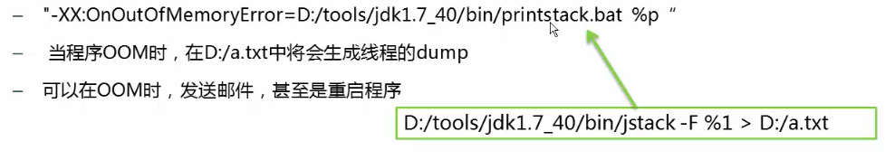

## 1. Trace跟踪参数

(jdk11使用jvm统一日志框架，很多参数改变，https://docs.oracle.com/en/java/javase/11/tools/java.html#GUID-BE93ABDC-999C-4CB5-A88B-1994AAAC74D5)

下面主要以jdk8为例：


-verbose:gc

-XX:+PrintGC 已过时用-Xlog:gc代替(jdk11)

可以打印GC的简要信息

```
[0.028s][info][gc] Using G1
[1.030s][info][gc] GC(0) Pause Young (Concurrent Start) (G1 Humongous Allocation) 10M->0M(20M) 3.063ms
[1.030s][info][gc] GC(1) Concurrent Cycle
[1.032s][info][gc] GC(1) Pause Remark 1M->1M(20M) 0.743ms
[1.032s][info][gc] GC(1) Pause Cleanup 1M->1M(20M) 0.021ms
[1.032s][info][gc] GC(1) Concurrent Cycle 2.281ms
[1.754s][info][gc] GC(2) Pause Young (Concurrent Start) (G1 Humongous Allocation) 9M->0M(20M) 2.721ms
[1.754s][info][gc] GC(3) Concurrent Cycle
[1.757s][info][gc] GC(3) Pause Remark 1M->1M(20M) 2.320ms
[1.757s][info][gc] GC(3) Pause Cleanup 1M->1M(20M) 0.022ms
[1.758s][info][gc] GC(3) Concurrent Cycle 3.838ms

```

-XX:+PrintGCDetails过时了用 -Xlog:gc*代替(jdk11)

​	打印GC详细信息


-XX:+PrintGCTimeStamps（jdk11没有这个参数了，上面参数会自动打印时间戳）

​	打印GC发生的时间戳


jdk8 

0x00000000ff980000起始位置    0x0000000100000000当前边界   0x0000000100000000最高边界

```
Heap
 PSYoungGen      total 6144K, used 4756K [0x00000000ff980000, 0x0000000100000000, 0x0000000100000000)
  eden space 5632K, 77% used [0x00000000ff980000,0x00000000ffdc5308,0x00000000fff00000)
  from space 512K, 75% used [0x00000000fff80000,0x00000000fffe0020,0x0000000100000000)
  to   space 512K, 0% used [0x00000000fff00000,0x00000000fff00000,0x00000000fff80000)
 ParOldGen       total 13824K, used 8K [0x00000000fec00000, 0x00000000ff980000, 0x00000000ff980000)
  object space 13824K, 0% used [0x00000000fec00000,0x00000000fec02000,0x00000000ff980000)
 Metaspace       used 3053K, capacity 4496K, committed 4864K, reserved 1056768K
  class space    used 335K, capacity 388K, committed 512K, reserved 1048576K
```

jdk11

```
[1.817s][info][gc,heap,exit  ] Heap
[1.817s][info][gc,heap,exit  ]  garbage-first heap   total 20480K, used 1925K [0x00000000fec00000, 0x0000000100000000)
[1.817s][info][gc,heap,exit  ]   region size 1024K, 2 young (2048K), 1 survivors (1024K)
[1.817s][info][gc,heap,exit  ]  Metaspace       used 6502K, capacity 6590K, committed 6784K, reserved 1056768K
[1.817s][info][gc,heap,exit  ]   class space    used 572K, capacity 603K, committed 640K, reserved 1048576K
```


-Xloggc:log/gc.log    is deprecated. Will use -Xlog:gc:log/gc.log instead（jdk11）

​	指定gc位置，以文件输出

-XX:+PrintHeapAtGC  过时，改用 -Xlog:gc+heap=trace（jdk11）

​	每一次gc后，都会打印堆信息   

​	

```
{Heap before GC invocations=1 (full 0):
 PSYoungGen      total 6144K, used 5509K [0x00000000ff980000, 0x0000000100000000, 0x0000000100000000)
  eden space 5632K, 97% used [0x00000000ff980000,0x00000000ffee1638,0x00000000fff00000)
  from space 512K, 0% used [0x00000000fff80000,0x00000000fff80000,0x0000000100000000)
  to   space 512K, 0% used [0x00000000fff00000,0x00000000fff00000,0x00000000fff80000)
 ParOldGen       total 13824K, used 0K [0x00000000fec00000, 0x00000000ff980000, 0x00000000ff980000)
  object space 13824K, 0% used [0x00000000fec00000,0x00000000fec00000,0x00000000ff980000)
 Metaspace       used 3044K, capacity 4496K, committed 4864K, reserved 1056768K
  class space    used 334K, capacity 388K, committed 512K, reserved 1048576K
Heap after GC invocations=1 (full 0):
 PSYoungGen      total 6144K, used 416K [0x00000000ff980000, 0x0000000100000000, 0x0000000100000000)
  eden space 5632K, 0% used [0x00000000ff980000,0x00000000ff980000,0x00000000fff00000)
  from space 512K, 81% used [0x00000000fff00000,0x00000000fff68000,0x00000000fff80000)
  to   space 512K, 0% used [0x00000000fff80000,0x00000000fff80000,0x0000000100000000)
 ParOldGen       total 13824K, used 8K [0x00000000fec00000, 0x00000000ff980000, 0x00000000ff980000)
  object space 13824K, 0% used [0x00000000fec00000,0x00000000fec02000,0x00000000ff980000)
 Metaspace       used 3044K, capacity 4496K, committed 4864K, reserved 1056768K
  class space    used 334K, capacity 388K, committed 512K, reserved 1048576K
}
```


-XX:+TraceClassLoading

​	监控类的加载

```
[Opened /usr/local/jdk1.8.0_191/jre/lib/rt.jar]
[Loaded java.lang.Object from /usr/local/jdk1.8.0_191/jre/lib/rt.jar]
[Loaded java.io.Serializable from /usr/local/jdk1.8.0_191/jre/lib/rt.jar]
[Loaded java.lang.Comparable from /usr/local/jdk1.8.0_191/jre/lib/rt.jar]
[Loaded java.lang.CharSequence from /usr/local/jdk1.8.0_191/jre/lib/rt.jar]
[Loaded java.lang.String from /usr/local/jdk1.8.0_191/jre/lib/rt.jar]
[Loaded java.lang.reflect.AnnotatedElement from /usr/local/jdk1.8.0_191/jre/lib/rt.jar]
[Loaded java.lang.reflect.GenericDeclaration from /usr/local/jdk1.8.0_191/jre/lib/rt.jar]
.....
```

-XX:+PrintClassHistogram

​	按下CTRL+BREAK	后，打印类信息

​	序号    实例数量  总大小  类型


## 2. 堆的分配参数

-Xms 最小堆空间

-Xmx 最大堆空间

-Xmn 新生代大小

-XX：NewRatio  新生代（eden+2*s）和老年代的比值

​	4表示：新生代：老年代=1：4 ,即新生代占1/5

-XX:SurvivorRatio  设置eden区和两个Survivor区的对比

​	8表示：两个Survivor:eden = 2:8	      4表示：两个Survivor:eden = 2:4

​	eden 8   Survivor 1×2 总共分成10份       eden 4  Survivor 1×2 总共分成6份      


设置新生代大小为3m，开一个3m的对象，循环3次

全部分配在老年代，输出结果没有触发GC

```java
-Xms20m -Xmx20m -Xmn3m -XX:+PrintGCDetails

public class App4 {

    public static void test(){
        byte[] bytes = new byte[1024*1024*3];
    }
    public static void main(String[] args) {

       for(int i = 0;i<3;i++){
            App2.test();
        }
    }
}
```

```
Heap
 PSYoungGen      total 2560K, used 1366K [0x00000000ffd00000, 0x0000000100000000, 0x0000000100000000)
  eden space 2048K, 66% used [0x00000000ffd00000,0x00000000ffe55be0,0x00000000fff00000)
  from space 512K, 0% used [0x00000000fff80000,0x00000000fff80000,0x0000000100000000)
  to   space 512K, 0% used [0x00000000fff00000,0x00000000fff00000,0x00000000fff80000)
 ParOldGen       total 17408K, used 6144K [0x00000000fec00000, 0x00000000ffd00000, 0x00000000ffd00000)
  object space 17408K, 35% used [0x00000000fec00000,0x00000000ff200030,0x00000000ffd00000)
 Metaspace       used 3054K, capacity 4500K, committed 4864K, reserved 1056768K
  class space    used 335K, capacity 388K, committed 512K, reserved 1048576K

```


设置新生代15m，3m的对象，循环5次，全部分配在eden，老年代没有使用，依旧没有触发gc

```
-Xms20m -Xmx20m -Xmn15m -XX:+PrintGCDetails

public class App4 {

    public static void test(){
        byte[] bytes = new byte[1024*1024*3];
    }
    public static void main(String[] args) {

       for(int i = 0;i<5;i++){
            App2.test();
        }
    }
}
```

```
Heap
 PSYoungGen      total 13824K, used 12226K [0x00000000ff100000, 0x0000000100000000, 0x0000000100000000)
  eden space 12288K, 99% used [0x00000000ff100000,0x00000000ffcf0960,0x00000000ffd00000)
  from space 1536K, 0% used [0x00000000ffe80000,0x00000000ffe80000,0x0000000100000000)
  to   space 1536K, 0% used [0x00000000ffd00000,0x00000000ffd00000,0x00000000ffe80000)
 ParOldGen       total 5120K, used 0K [0x00000000fec00000, 0x00000000ff100000, 0x00000000ff100000)
  object space 5120K, 0% used [0x00000000fec00000,0x00000000fec00000,0x00000000ff100000)
 Metaspace       used 3052K, capacity 4500K, committed 4864K, reserved 1056768K
  class space    used 335K, capacity 388K, committed 512K, reserved 1048576K
```

设置新生代15m，3m的对象，循环7次，全部分配在eden，老年代没有使用，发生一次gc

```
-Xms20m -Xmx20m -Xmn15m -XX:+PrintGCDetails

public class App4 {

    public static void test(){
        byte[] bytes = new byte[1024*1024*3];
    }
    public static void main(String[] args) {

       for(int i = 0;i<7;i++){
            App2.test();
        }
    }
}

[GC (Allocation Failure) [PSYoungGen: 11980K->416K(13824K)] 11980K->424K(18944K), 0.0015655 secs] [Times: user=0.00 sys=0.00, real=0.00 secs] 
Heap
 PSYoungGen      total 13824K, used 4873K [0x00000000ff100000, 0x0000000100000000, 0x0000000100000000)
  eden space 12288K, 36% used [0x00000000ff100000,0x00000000ff55a4f0,0x00000000ffd00000)
  from space 1536K, 27% used [0x00000000ffd00000,0x00000000ffd68000,0x00000000ffe80000)
  to   space 1536K, 0% used [0x00000000ffe80000,0x00000000ffe80000,0x0000000100000000)
 ParOldGen       total 5120K, used 8K [0x00000000fec00000, 0x00000000ff100000, 0x00000000ff100000)
  object space 5120K, 0% used [0x00000000fec00000,0x00000000fec02000,0x00000000ff100000)
 Metaspace       used 3055K, capacity 4500K, committed 4864K, reserved 1056768K
  class space    used 335K, capacity 388K, committed 512K, reserved 1048576K
```


若进行gc时，s0,s1区也装不下，需要老年代担保,进行了两次新生代GC

```
-Xms20m -Xmx20m -Xmn10m -XX:SurvivorRatio=1 -XX:+PrintGCDetails

public class App4 {

    public static void test(){
        byte[] bytes = new byte[1024*1024*3];
    }
    public static void main(String[] args) {

       for(int i = 0;i<7;i++){
            App2.test();
        }
    }
}
```

```
[GC (Allocation Failure) [PSYoungGen: 3465K->448K(7168K)] 11657K->8648K(17408K), 0.0013175 secs] [Times: user=0.00 sys=0.01, real=0.00 secs] 
[GC (Allocation Failure) [PSYoungGen: 2496K->448K(7168K)] 10696K->8648K(17408K), 0.0013614 secs] [Times: user=0.00 sys=0.00, real=0.00 secs] 
Heap
 PSYoungGen      total 7168K, used 2619K [0x00000000ff600000, 0x0000000100000000, 0x0000000100000000)
  eden space 4096K, 53% used [0x00000000ff600000,0x00000000ff81ed18,0x00000000ffa00000)
  from space 3072K, 14% used [0x00000000ffd00000,0x00000000ffd70000,0x0000000100000000)
  to   space 3072K, 0% used [0x00000000ffa00000,0x00000000ffa00000,0x00000000ffd00000)
 ParOldGen       total 10240K, used 8200K [0x00000000fec00000, 0x00000000ff600000, 0x00000000ff600000)
  object space 10240K, 80% used [0x00000000fec00000,0x00000000ff402040,0x00000000ff600000)
 Metaspace       used 3055K, capacity 4500K, committed 4864K, reserved 1056768K
  class space    used 335K, capacity 388K, committed 512K, reserved 1048576K
```


-XX:+HeapDumpOnOutOfMemoryError

​	OOM时导出堆到文件

-XX:HeapDumpPath="xxx"  导出OOM的路径

-XX:OnOutOfMemoryError="xxx"

​	在OOM时，执行一个脚本

​	

 根据实际情况调整新生代和幸存代的大小

官方推荐新生代占堆3/8

幸存代占新生代1/10

在OOM时，记得Dump出堆，确保可以排查现场问题


永久区分配参数：**jdk8以后没有永久区了**

-XX:PermSize    -XX:MaxPermSize

设置永久区初始空间和最大空间，他们表示，一个系统可以容纳多少个类型

使用CGLIB等库的时候，可能会产生大量的类，这些类，有可能撑爆永久区导致OOM

如果堆空间没有用完也抛出OOM，有可能是永久区导致的


## 3. 栈的分配参数

-Xss

​	通常只有几百k

​	决定了函数调用的深度

​	每个线程都有独立的空间

​	局部变量、参数分配在栈上

   栈是线程分配的空间，栈分配空间越大，可容纳线程数越少，栈分配空间越小，函数调用深度就越小

递归调用-java.lang.StackOverflowError


## 4. 作业

http://xpws2006.blog.163.com/blog/static/95438577200891651655351/
http://blog.csdn.net/cping1982/article/details/2865198
其实这样来看，from和to其实只是一个逻辑概念，对于物理上来说，新生代其实就是分配对象的内存+待复制对象的内存空间

-XX:+PrintGCDetails
-XX:+PrintGCDetails这个是每次gc都会打印的，只是程序结束后才打印详细的堆信息
 -Xmx不包含，持久代空间
堆空间是连续的

 -------------------作业第一题--------------------
首先了解到：Java运行主要引赖于bin和Lib目录，bin目录主要存储了java命令和需要的dll
lib目录是java虚拟机要用到的class和配置文件。
bin目录精简的方式：
1、bin目录最主要的工具是java.exe,它用来执行class文件.
如果只是为了单纯运行Java程序的话,其他可执行文件一般都是用不到的(可剔除).

2、 bin目录里面的动态链接库文件dll是java.exe执行class文件过程中调用的.
执行class文件,java.exe需要哪个库文件就加载哪个dll,不需用的可以剔除.
查看java用到那个dll的，可以通过windows的任务管理器，查看进程号，再用其它工具（如360）
查看引用到的dll

lib精简方式：
这里面我给出一个精简rt.jar的程序，自己写的.（这里主要是给出了精简rt.jar的程序）
主要思想就是：
1、把程序运行所需要的class文件通过-XX:TraceClassLoading打印到文本文件
2、用自己写的程序把需要的class和rt路径，精简rt存放的路径设置好
3、然后将rt1里面的目录和文件打包成rt.zip,改名为rt.jar，然后替换原来的rt.jar
4、可以达到精简的作用，再将Java.exe和对应的dll copy到相应的目录，
5、写一个批处理命令，用于自带的Java去执行jar包。

import java.io.BufferedReader;
import java.io.File;
import java.io.FileInputStream;
import java.io.FileOutputStream;
import java.io.IOException;
import java.io.InputStream;
import java.io.InputStreamReader;
import java.util.jar.JarEntry;
import java.util.jar.JarFile;

import org.apache.commons.io.IOUtils;
//自己写的
public class CutJre {
​	private String needClazz = "d:\\needClazz.txt";//需要的class
​	private String rtPath = "D:\\Program Files\\Java\\jre6\\lib";//rt存放路径
​	private String dstRtPath = "D:/cutJar/";//精简后的路径
​	private JarFile rtJar;

	public static void main(String[] args) throws Exception {
		CutJre cutJre = new CutJre();
		cutJre.rtJar = new JarFile(cutJre.rtPath + "\\rt.jar");
		cutJre.copyClass("[Loaded sun.reflect.FieldAccessor from sda]");
//		 cutJre.execute();
​	}

	private void execute() throws Exception {
		BufferedReader br = new BufferedReader(new InputStreamReader(
				new FileInputStream(needClazz)));
		String string = br.readLine();
		while (string != null) {
			string = br.readLine();
		}
	}
	
	private boolean copyClass(String traceStr) throws IOException {
		if (traceStr.startsWith("[Loaded")) {
			String className = traceStr.split(" ")[1];
			//不是rt里面的Jar包，是自己有的
			if(className.contains("zh")){
				return true;
			}
			copyFile(className);
		}
		return false;
	}
	
	private void copyFile(String className) throws IOException {
		String classFile = className.replace(".", "/") + ".class";
		String classDir = classFile.substring(0,classFile.lastIndexOf("/"));
	
		File dir=new File(dstRtPath+classDir);
		System.out.println(dir);
		if(!dir.exists()){
			dir.mkdirs();
		}
		JarEntry jarEntry = rtJar.getJarEntry(classFile);
		InputStream ins = rtJar.getInputStream(jarEntry);
		File file = new File(dstRtPath+ classFile);
		System.out.println(file);
		if(!file.exists()){
			file.createNewFile();
		}
		FileOutputStream fos = new FileOutputStream(file);
		IOUtils.copy(ins, fos);
		ins.close();
		fos.close();
	
	}
}

第二题：
认为最可能的启动JVM参数：
-Xms25m -Xmx40m -Xmn7m -XX:+PrintGCDetails -XX:PermSize=16m

首先 def new generation   total 6464K, used 115K [0x34e80000, 0x35580000, 0x35580000)
 eden space 5760K,   2% used [0x34e80000, 0x34e9cd38, 0x35420000)
  from space 704K,   0% used [0x354d0000, 0x354d0000, 0x35580000)
  to   space 704K,   0% used [0x35420000, 0x35420000, 0x354d0000)
通过这一行可以知道年轻代大小是7m.

通过 tenured generation   total 18124K, used 8277K [0x35580000, 0x36733000, 0x37680000)

（0x37680000-0x35580000）/1024/1024得到的结果是33m

通过以上可以得到最大堆是40m。但通过eden大小和 tenured generation   total 18124K计算出最小堆应该是25m

通过compacting perm gen  total 16384K, 可以计算出持久堆-XX:PermSize=16m