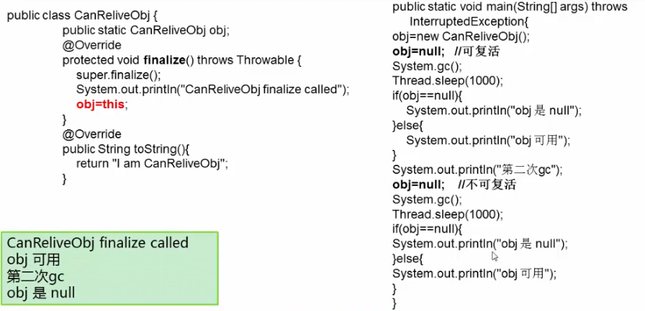

## GC的概念

Garbage Collection 垃圾收集

主要是回收堆空间（和永久区(1.8以前)）


## GC算法

 - 引用计数法（java没有采用）
    - 引用和去引用伴随加法和减法影响性能
    - 很难处理循环引用
- 可达性分析


 - 标记清除法
    - 标记所有从根节点可达的算法，未被标记对象引用的就是垃圾对象
    - 在清除阶段，清楚所有未被标记的对象
 - 标记整理法
    - 在清除阶段，将所有存活对象压缩到内存的一端，清理边界外所有的空间
    - 不会产生碎片
 - 复制回收算法
    - 空间浪费
    - 老年对象、大对象(幸存代放不下)放入老年代

分代思想

​	根据对象的生命周期进行分类

​	根据不同代的特点，选取合适的收集算法

​		少量对象存活，适合复制算法  

​		大量对象存活，适合标记清除或者标记整理算法

## 可达性分析

从根节点可以可以触及到这个对象。

可以在finalize()挽救，不一定成功，finalize()只会执行一次，第二次一定会回收掉




避免使用finalize()，操作不慎可能导致错误

优先级低，专门开了一个优先级低的线程去执行

可以使用try-catch-finally来代替它

根：

​	虚拟机栈中引用的对象

​	方法区中的静态成员或者常量引用的对象(全局对象)

​	JNI方法栈中引用的对象

## Stop-The-World

Java中一种全局暂停的现象

全局暂停，所有Java代码停止，native代码都可以执行，但不能和JVM交互

多半由于GC引起

​	Dump线程

​	死锁检查

​	堆Dump


危害

​	长时间服务停止，没有响应

​	遇到HA系统，可能引起主备切换，严重危害生产环境

​	


## 作业

/**
 写一个程序，尽量产生STW现象。给出代码和启动JVM参数。并附上GC的log日志，标出停顿的时间。 
 答：
 尽量产生stw现象，最好就是年老代一直被填满，而且尽量保证捕获error，保证程序可以长时间运行，又能满足课题要求。
 产生stw其它几个因素：
 dump线程
 死锁检查
 堆dupm
 垃圾回收算法：为让stw时间较长，增大年老代空间和选用serial old垃圾算法进行回收老年代

 jvm垃圾回收参数：-Xms512m -Xmx512m -Xmn4m -XX:+PrintGCDetails -XX:+UseSerialGC 

 @author zhanghua

*/
   

    public class GenerateSTW {
        /**
    	通过集合引用对象，保证对象不被gc回收
    	*/
        private List<byte[]> content=new ArrayList<byte[]>();
        	public static void main(String[] args) {
        	GenerateSTW stw=new GenerateSTW();
        	stw.start();
        }
        private void start() {
            while(true){
                try {
                    content.add(new byte[1024]);
                } catch (OutOfMemoryError e) {
                    //在不可以分配的时候，进行清理部分空间,继续运行，这样会很快产生下一次垃圾回收
                for(int i=0;i<1024;i++){
                    content.remove(i);
                    }
    
                }
    
            }
    
        }
    }


```
gc:log
[GC [DefNew: 3711K->383K(3712K), 0.0065474 secs] 511956K->511923K(523904K), 0.0065829 secs][Times: user=0.00 sys=0.02, real=0.01 secs] 
[GC [DefNew: 3711K->383K(3712K), 0.0070612 secs] 515251K->515217K(523904K), 0.0070912 secs][Times: user=0.02 sys=0.00, real=0.01 secs] 
[GC [DefNew: 3711K->383K(3712K), 0.0071249 secs] 518545K->518512K(523904K), 0.0071581 secs][Times: user=0.00 sys=0.00, real=0.01 secs] 
[GC [DefNew: 3711K->3711K(3712K), 0.0000197 secs][Tenured: 518128K->520191K(520192K), 0.2000829 secs] 521840K->521807K(523904K), [Perm : 2106K->2106K(12288K)], 0.2001707 secs][Times: user=0.19 sys=0.00, real=0.20 secs] 
[Full GC [Tenured: 520191K->520191K(520192K), 0.1989891 secs] 523903K->523886K(523904K), [Perm : 2106K->2106K(12288K)], 0.1990396 secs][Times: user=0.19 sys=0.00, real=0.20 secs] 
[Full GC [Tenured: 520191K->520191K(520192K), 0.1843441 secs] 523902K->523902K(523904K), [Perm : 2106K->2106K(12288K)], 0.1843975 secs][Times: user=0.19 sys=0.00, real=0.18 secs] 
[Full GC [Tenured: 520191K->518799K(520192K), 0.5034074 secs] 523902K->518799K(523904K), [Perm : 2106K->2104K(12288K)], 0.5034560 secs][Times: user=0.50 sys=0.00, real=0.50 secs] 
[GC [DefNew: 3328K->3328K(3712K), 0.0000172 secs][Tenured: 518799K->520191K(520192K), 0.1844447 secs] 522127K->522119K(523904K), [Perm : 2104K->2104K(12288K)], 0.1845251 secs][Times: user=0.17 sys=0.00, real=0.19 secs] 
[Full GC [Tenured: 520191K->520191K(520192K), 0.1819704 secs] 523903K->523901K(523904K), [Perm : 2104K->2104K(12288K)], 0.1820234 secs][Times: user=0.17 sys=0.00, real=0.18 secs] 
[Full GC [Tenured: 520191K->520191K(520192K), 0.1820428 secs] 523902K->523902K(523904K), [Perm : 2104K->2104K(12288K)], 0.1820878 secs][Times: user=0.19 sys=0.00, real=0.18 secs] 
[Full GC [Tenured: 520191K->520191K(520192K), 0.1829175 secs] 523902K->523902K(523904K), [Perm : 2104K->2104K(12288K)], 0.1829629 secs][Times: user=0.17 sys=0.00, real=0.18 secs] 
```

2、是否有方法尽可能减少一次STW停顿时间？由此带来的弊端是什么？
答：减少一次STW停顿时间，我这里从三个方面回答，一个是垃圾算法选择，一个是程序使用堆设置，无用对象尽早释放
垃圾算法选择：现在都是多核cpu，可以采用并行和并发收集器，如果是响应时间优化的系统应用 ，则jdk6版本一般

选择的垃圾回收算法是：XX:+UseConcMarkSweepGC,即cms收集器，这个收集器垃圾回收时间短，但是垃圾回收总时间变长，使的降低吞
吐量，算法使用的是标记-清除，并发收集器不对内存空间进行压缩,整理,所以运行一段时间以后会产生"碎片",使得运行效率降低.
CMSFullGCsBeforeCompaction此值设置运行多少次GC以后对内存空间进行压缩,整理

2、程序使用堆设置：应该根据程序运行情况，通过Jvm垃圾回收分析，设置一个比较合适的堆大小，不能一意味的将堆设置过大，导致
程序回收很大一块空间，所以会导致stw时间较长，

3、无用对象尽早释放：使用的对象，如果没有用，尽早设置null,尽量在年轻代将对象进行回收掉，可以减少full gc停顿时长


