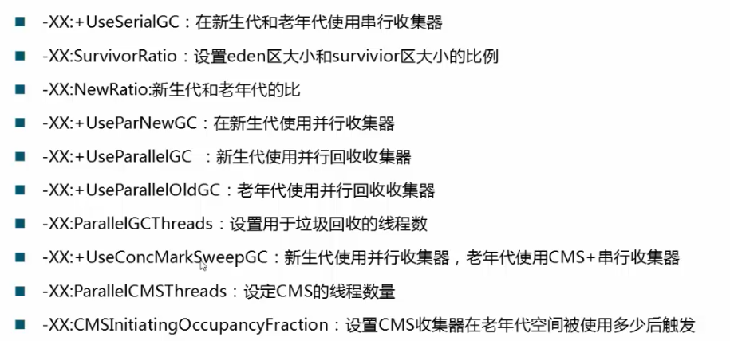
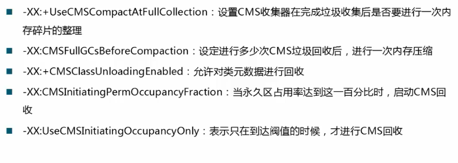

## 串行收集器

最古老，最稳定

效率高

可能会产生较长的停顿

-XX:+UseSerialGC

​	新生代老年代都会使用串行回收

​	新生代复制回收算法

​	老年代标记-整理算法

## 并行收集器

### ParNew

-XX:+UseParNewGC

​	新生代并行

​	老年代串行

Serial收集器新生代的并行版本

复制回收算法

多线程，需要多核支持

-XX:ParallelGCThreads 限制线程数量

### Parallel收集器

类似ParNew

新生代复制回收算法

老年代 标记-整理

更加关注吞吐量

-XX:+UseParallelGC

​	新生代使用Parallel收集器并行+老年代串行

-XX:+UseParallelOldGC

​	新生代使用Parallel收集器并行+老年代并行

-XX:MaxGCPauseMills

​	最大停顿时间，单位毫秒

​	GC尽力保证回收时间不超过设定值

-XX:GCTimeRatio

​	0-100取值范围

​	垃圾收集时间占总时间的比

​	默认99,即最大允许1%时间做GC

这两个参数是矛盾的，因为停顿时间和吞吐量不可能同时调优

## CMS收集器

Concurrent Mark Sweep并行标记清除

并发阶段会降低吞吐量（和应用程序一起执行）

老年代收集器（新生代使用ParNew）

-XX:UseConcMarkSweepGC

CMS运行过程比较复杂，着重实现了标记的过程，可分为

- 初始标记(停顿)
  - 根可以直接关联到的对象
  - 速度快
- 并发标记（和用户线程一起）
  - 主要标记过程，标记全部对象
- 重新标记（停顿）
  - 由于并发标记时，用户线程依然运行，因此在正式清理前，再做修正
- 并发清楚（和用户线程一起）
  - 基于标记结果，直接清理对象

特点：

​	尽可能降低停顿

​	会影响系统整体吞吐量和性能（一部分cpu去做GC）

​	清理不彻底

​	因为和用户线程一起运行，不能在空间快满时再清理

​		-XX:CMSInitatingOccupancyFraction设置触发GC的阀值

​		如果不幸，预留空间不够用，会引起concurrent mode failure(使用串行收集器作为后备)	

-XX:+UseCMSCompactAtFullCollection Full GC后，进行一次整理

​	整个过程是独占的，可能会引起停顿时间变长

-XX:CMSFullGCsBeforeCompaction

​	设置进行几次Full GC后，进行一次碎片整理

-XX:ParallelCMSThreads

​	设定CMS的线程数量

## Tomcat实例演示

## 总结

性能的根本在应用

GC参数属于微调

设置不合理，会影响性能，产生大的延时

