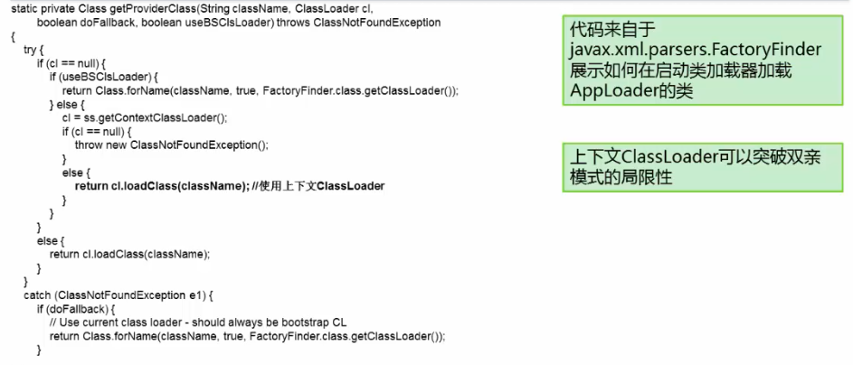
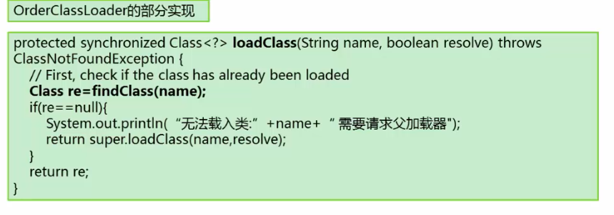
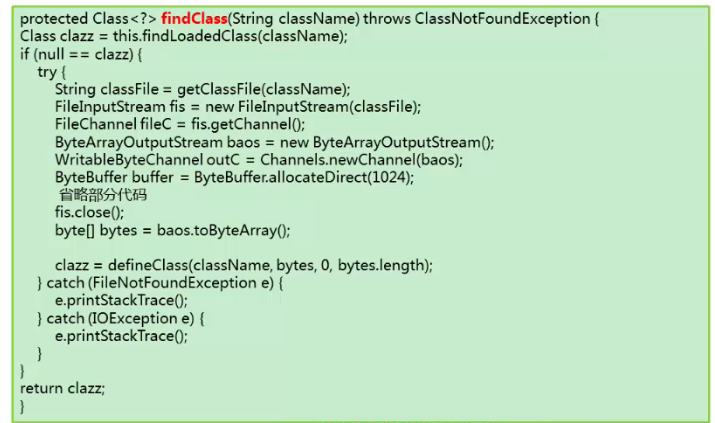

## class装载验证流程

  加载

​	装载类的地一个阶段

 	取得类的二进制流

​	转为方法区数据结构

​	在java堆中生成对应的java.lang.Class对象	

链接

​	验证

​		目的：保证Class流的格式是正确的

​		文件格式的验证

​			是否以0xCAFEBABE开头

​			版本号是否合理		

​		元数据验证

​			是否有父类

​			继承了final类？

​			非抽象类实现了所有的抽象方法

​		字节码验证

​			运行检查

​			栈数据类型和操作码数据参数吻合

​			跳转指令指定到合理的位置

​	准备

​		分配内存，并为类设置初始值（方法区中）

​			static变量 赋予默认值

​			static final类型，赋予正确的值

​	解析

​		符号引用转换为直接引用（指针或地址偏移量）

​	

初始化

​	执行类构造器<clinit>

​		static变量赋值语句

​		static{}语句

​	子类的<clinit>调用前保证父类的<clinit>被调用

​	<clinit>是线程安全的

## 什么是类装载器

ClassLoader是一个抽象类

ClassLoader的实例将读入Java字节码，将类装载到JVM中

ClassLoader可以定制，满足不同的字节流获 取方式

ClassLoader负责类装载过程中的**加载**阶段

ClassLoader的重要方法：

​	loadClass

​	defineClass

​	findClass

​	findLoadedClass

## JDK中ClassLoader默认设计模式

BootStrap		rt.jar /-Xbootclasspath

Extentsion		/lib/ext/*.jar

App				Classpath

Custom

双亲委派模式：顶层ClassLoader无法加载底层ClassLoader的类

解决：

​	Thread.getContextClassLoader()

​	上下文加载器

​	是一个角色

​	用以解决顶层ClassLoader无法访问底层ClassLoader的类的问题

​	基本思想是：在顶层ClassLoader，传入底层ClassLoader的实例

## 打破常规模式

双亲模式的破坏：

​	双亲模式是默认的模式，但不是必须这么做

​	Tomcat的webappClassLoader就会先加载自己的class，找不到再委托parent

​	osgi的ClassLoader形成网状结构，根据需要自由加载Class

破坏双亲模式的例子-先从底层ClassLoader加载

​	

## 热替换

当一个class被替换后，系统无需重启，替换的类立即生效

## 作业

运行一个程序HelloMain，他会循环调用另外一个类Worker.doit()方法。此时，对Worker.doit()方法做更新。要求 更新后，HelloMain可以发现新的版本。
  可以选择替换class文件 ，也可以选择替换jar包。

答：我在这里选择的是替换class.
   这题的关键是发现class文件改变，用新的classloader去加载class文件，然后程序调用的也是通过新加载的class去调用。
   由于Java有双亲委派模式加哉，故需要热部署的class必须通过自定义的classloader去加载。
   强调同一个类的概念：
1.类加载器负责加载所有的类，系统为所有被载入内存中的类生成一个java.lang.Class实例.一旦一个类被载入JVM中，同一个类就不会被再次载入了。
2.在Java中，一个类用其全限定类名，包名和类名，作为标识；但在JVM中一个类用其全限定类名和其类加载器作为其唯一标识。 即，如果Worker被appclassloader加载过后，又被自定义classloader加载，它们两个不是同一个class.
所以在我的程序中，Worker不能被appclassloader，即在我的程序中不能明确使用“Worker.doit()”。这里我是通过反射调用的，