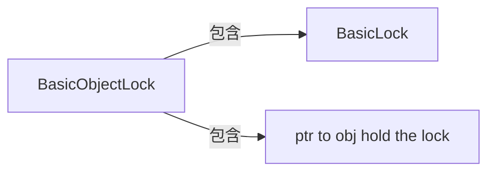

## 1. 线程安全

## 2. 对象头

​	Mark Word，对象头的标记32位

​	描述对象的hash、锁信息、垃圾回收标记、年龄

​		指向锁记录的指针

​		指向monitor的指针

​		GC标记

​		偏向锁线程ID

## 3. 偏向锁

- 大部分情况是没有竞争的，所以可以通过偏向来提高性能
- 所谓的偏向，就是偏心，锁会偏向于当前已经占有锁的线程
- 将对象头Mark的标记设置为偏向，并将线程ID写入对象头Mark
- 只要没有竞争，获得偏向锁的线程，在将来进入同步块，不需要做同步
- 当其他线程请求锁时，偏向模式结束
- -XX:+UseBiasedLocking  默认启用   -XX:BiasedLockingStartupDelay=0 系统启动后多长时间启用（一般系统启动几秒后才启用）
- 在竞争激烈的场合，偏向锁会增加系统负担

## 4. 轻量级锁

BasicObjectLock  嵌入在线程栈中的对象



普通的锁处理性能不够理想，轻量级锁是一种快速的锁定的方法

如果对象没有被锁定

​	将对象头的Mark指针保存到锁对象中

​	将对象头设置为指向锁的指针（在线程栈空间中）

如果轻量级锁失败，表示存在竞争，升级为重量级锁（常规锁）

在没有锁竞争的前提下，减少传统锁使用OS互斥量产生的性能损耗

在竞争激烈时，轻量级锁会多做很多额外操作，导致性能下降

## 5. 自旋锁

在存在竞争时，如果线程可以很快的获得锁，那么可以不在os层挂起线程，让线程做几个空操作（自旋）

JDK1.6中 -XX:UseSpinning开启

JDK1.7中，去掉次参数，改为内置实现

如果同步块很长，自旋失败，会降低系统性能

如果同步块很短，自旋成功，节省线程挂起切换时间，提升系统性能


## 6. 优化

减少锁持有时间

减少锁力度

​	将大对象拆成小对象，大大增加并行度，降低锁竞争

​	偏向锁，轻量级锁成功率提高

​	ConcurrentHashMap

​		若干个segment，每次锁定一个segment

​		减小锁粒度后，ConcurrentHashMap允许多个线程同时进入

​	HashMap的同步实现

## 7. 锁分离

​	根据功能进行分离

​	ReadWriteLock

​	读多写少的情况，可以提高性能

​	读写分离思想可以延伸，只要操作互不影响，锁就可以分离

​	LinkedBlockingQueue

​		队列

​		链表

## 8. 锁粗化

​	凡事有一个度，如果对同一个锁不停的进行请求、同步和释放，其本身也会消耗系统宝贵的资源，反而不利于性能的优化

## 9. 锁消除

​	在即时编译时，如果发现不可能被共享的对象，则可以消除这些对象的锁操作

​	-server -XX:+DoEscapeAnalysis  -XX:+EliminateLocks   (打开逃逸分析，打开锁消除)

```java
StringBuffer sb = new StringBuffer();
sb.append("aa");
sb.append("bb");
```

## 10.无锁

​	锁是悲观的操作

​	无锁是乐观的操作

​	无所的一种实现方式

​		cas

​		非阻塞同步

​	在应用层面判断多线程的干扰，如果有干扰，则通知线程重试  


## 11. 作业

1. 写2个程序，分别使用无锁的方式，和有锁的方式对某一个整数进行++操作直到某一个很大的值M，同样使用N个线程，给出2个程序的性能比较
  当N=3 30 300 1000
  M=1000000
  给出以上4种情况的性能比较
  答：
  当n=3时
    LockRunnable threads 3：stime:1413100154405  etime:1413100155190 ctime:785 value:2000001
  NoLockRunnable threads 3：stime:1413100155191  etime:1413100155243 ctime:52 value:2000002
  当n=30时
    LockRunnable threads 30：stime:1413100197538  etime:1413100198266 ctime:728 value:2000028
  NoLockRunnable threads 30：stime:1413100198268  etime:1413100198351 ctime:83 value:2000005
  当n=300时
    LockRunnable threads 300：stime:1413100211515  etime:1413100212341 ctime:826 value:2000298
  NoLockRunnable threads 300：stime:1413100212344  etime:1413100212607 ctime:263 value:2000001
  当n=1000时
    LockRunnable threads 1000：stime:1413100226395  etime:1413100229474 ctime:3079 value:2000326
  NoLockRunnable threads 1000：stime:1413100229476  etime:1413100231860 ctime:2384 value:2000001
  总结如下：
  无锁的方式比有锁快，当M越大时，差别越大。
  是用一个java程序,代码如下：

import java.util.concurrent.ExecutorService;
import java.util.concurrent.Executors;
import java.util.concurrent.TimeUnit;
import java.util.concurrent.atomic.AtomicInteger;

public class JvmLockCompare {
​	//线程数
​	private static int nThreads=1000;
​	//二百万
​	private static int endValue=2000*10*10*10;
​	public static void main(String[] args) throws InterruptedException {
​		System.out.println("当n="+nThreads+"时");
​		testLockMethod();
​		testNoLockMethod();

	}
	private static void testLockMethod() throws InterruptedException {
		//有锁方式
		LockRunnable lockMethod=new LockRunnable();
		LockRunnable.endValue=endValue;
		//初始化线程
		ExecutorService service=  Executors.newFixedThreadPool(nThreads);
		//开始计算 
		long stime=System.currentTimeMillis();
		for(int i=0;i<nThreads;i++){
			service.submit(lockMethod);
		}
		service.shutdown();
		service.awaitTermination(Integer.MAX_VALUE, TimeUnit.SECONDS);
		//结束计算 
		long etime=System.currentTimeMillis();
		//打印日志
		System.out.println("  LockRunnable threads "+nThreads+"：stime:"+stime+"  etime:"+etime+" ctime:"+(etime-stime)+" value:"+LockRunnable.startValue);
	}
	private static void testNoLockMethod() throws InterruptedException {
		//无锁方式
		NoLockRunnable lockMethod=new NoLockRunnable();
		NoLockRunnable.endValue=endValue;
		//初始化线程
		ExecutorService service=  Executors.newFixedThreadPool(nThreads);
		//开始计算 
		long stime=System.currentTimeMillis();
		for(int i=0;i<nThreads;i++){
			service.submit(lockMethod);
		}
		service.shutdown();
		service.awaitTermination(Integer.MAX_VALUE, TimeUnit.SECONDS);
		//结束计算 
		long etime=System.currentTimeMillis();
		//打印日志
		System.out.println("NoLockRunnable threads "+nThreads+"：stime:"+stime+"  etime:"+etime+" ctime:"+(etime-stime)+" value:"+NoLockRunnable.startValue);
	}

}
class NoLockRunnable implements Runnable{
​	protected static AtomicInteger startValue=new AtomicInteger();
​	protected static int endValue;

	@Override
	public void run() {
		int value=startValue.get();
		while(value<endValue){
			value=startValue.incrementAndGet();
		}
	}
}
class LockRunnable implements Runnable{
​	protected  static int startValue;
​	protected static int endValue;
​	@Override
​	public void run() {
​		while(startValue<endValue){
​			addValue();
​		}
​	}
​	private synchronized void addValue() {
​		startValue++;
​	}
}
2. JVM获得锁的一般步骤是什么？（伤心。。不知道对不对呀）
  1、偏向锁可用会先尝试偏向锁
  2、轻量级锁可用会先尝试轻量级锁
  3、以上都失败，尝试自旋锁
  4、再失败，尝试普通锁，使用OS互斥量在操作系统层挂起