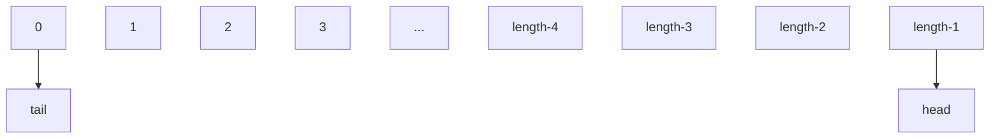

# ArrayDeque

## 介绍

- 上篇已经介绍了Deque的方法，这次介绍ArrayDeque的实现原理，并对几个主要方法进行讲解（jdk11）

1. ArrayDeque是可扩容的，内部用数组实现
2. 不允许添加null元素
3. 不是线程安全的
4. 做栈（Stack）时性能比`Stack`好，做队列（Queue）时性能比`LinkedList`好

## 原理



如上图所示，`ArrayDeque`模型可以说是这样的，`tail`指向内部数组的起始位置，而head指向内部数组末尾。

- 添加元素

  每次向尾部添加元素时`tail+1`，每次向头部添加元素时`head-1`，当`head`与`tail`相遇时，内部数组进行扩容。

- 删除元素

  在尾部弹出元素时`tail-1`，如果`tail<0` --->  `tail = length-1`，然后继续`tail-1`

  在头部弹出元素时`head+1`，如果`head>=length` --->  `head=0`，然后继续`head+1`


## 主要方法介绍

- `addFirst`方法

  ``` java
      public void addFirst(E e) {
          if (e == null)
              throw new NullPointerException();
          final Object[] es = elements;
          es[head = dec(head, es.length)] = e;
          if (head == tail)
              grow(1);
      }
  ```

  1. 当调用addFirst时，如果传入元素为null，直接抛出空指针异常

  2. elements为ArrayDeque的内部数组，用来存放添加的数据。

  3. dec方法 

     ```java
         static final int dec(int i, int modulus) {
             if (--i < 0) i = modulus - 1;
             return i;
         }
     ```

     起始时head为0，es.length为16，传入dec方法中，if方法为true，返回值为15，`head=15`，然后`es[head]=e`，相当于头部第一个元素，存入了内部数组最后一个位置，加入第二个元素，调用此方法，将会放入倒数第二个位置...

  4. grow方法，单独拿出来讲

- `addLast`方法

  ```java
    public void addLast(E e) {
          if (e == null)
              throw new NullPointerException();
          final Object[] es = elements;
          es[tail] = e;
          if (head == (tail = inc(tail, es.length)))
              grow(1);
      }
  ```

  1. 当调用addLast时，如果传入元素为null，直接抛出空指针异常

  2. 第一次调用时，tail为0，第一个元素放入内部数组索引为0的位置（**有一点需要注意，尾部元素先添加，再做尾部指针移动，头部元素是先移动指针位置，再添加元素**）

  3. if里做了两件事

     1. 移动tail指向的下标，看一下inc方法实现

        ```java
            static final int inc(int i, int modulus) {
                if (++i >= modulus) i = 0;
                return i;
            }
        
        ```

        起始时`tail=0,es.length=16`，if为false，返回值为1，所以tail=1

     2. 判断tail与head是否重合

- `grow`方法

  ```java
      private void grow(int needed) {
          // overflow-conscious code
          final int oldCapacity = elements.length;
          int newCapacity;
          // Double capacity if small; else grow by 50%
          int jump = (oldCapacity < 64) ? (oldCapacity + 2) : (oldCapacity >> 1);
          if (jump < needed
              || (newCapacity = (oldCapacity + jump)) - MAX_ARRAY_SIZE > 0)
              newCapacity = newCapacity(needed, jump);
          final Object[] es = elements = Arrays.copyOf(elements, newCapacity);
          // Exceptionally, here tail == head needs to be disambiguated
          if (tail < head || (tail == head && es[head] != null)) {
              // wrap around; slide first leg forward to end of array
              int newSpace = newCapacity - oldCapacity;
              System.arraycopy(es, head,
                               es, head + newSpace,
                               oldCapacity - head);
              for (int i = head, to = (head += newSpace); i < to; i++)
                  es[i] = null;
          }
      }
  ```

  1. grow方法的入参needed为当前添加操作所需要的空间，当只添加一个元素时为1，添加多个元素时就是多个元素的长度。

  2. jump为默认扩容大小，当长度<64时，扩容大小为原来的长度+2，否则为原来长度一半。

  3. if判断为默认扩容大小与需要扩容大小做了一个比较，然后又与最大长度做了一个比较，同时计算出了需要扩容的空间。

     `newCapacity`里面的方法也很简单，下面介绍一下

     ```java
         private int newCapacity(int needed, int jump) {
             final int oldCapacity = elements.length, minCapacity;
             if ((minCapacity = oldCapacity + needed) - MAX_ARRAY_SIZE > 0) {
                 if (minCapacity < 0)
                     throw new IllegalStateException("Sorry, deque too big");
                 return Integer.MAX_VALUE;
             }
             if (needed > jump)
                 return minCapacity;
             return (oldCapacity + jump - MAX_ARRAY_SIZE < 0)
                 ? oldCapacity + jump
                 : MAX_ARRAY_SIZE;
         }
     ```

     1. 如果需要的长度超过超过最大容量的情况下，如果超出了Integer的最大值，则会跑出异常，如果没超过就返回Integer最大长度。`MAX_ARRAY_SIZE`需要介绍一下：有一些虚拟机需要存储一些头信息在数组里，如果扩容到Integer.MAX_VALUE会造成内存溢出，所以有如下默认值：

        `private static final int MAX_ARRAY_SIZE = Integer.MAX_VALUE - 8;`

     2. 如果需要扩容的长度大于默认扩容的长度，就返回`minCapacity = oldCapacity + needed`的值

     3. 如果默认扩容的长度比实际需要的长度大，并且比最大空间`MAX_ARRAY_SIZE`小，则返回默认计算的长度`oldCapacity + jump`，否则返回最大长度MAX_ARRAY_SIZE

  4. 调用Arrays.copyOf方法，把元素移到新容量的数组中

  5. if判断里其实做了一个移动，因为扩容后的新数组head至oldCapacity这段区间内的数据需要移动到head + （newCapacity - oldCapacity）至newCapacity这段区间内。然后再把原来位置的元素至为null
- `removeFirst`方法

  ```java
  public E removeFirst() {
      E e = pollFirst();
      if (e == null)
          throw new NoSuchElementException();
      return e;
  }
  public E pollFirst() {
          final Object[] es;
          final int h;
          E e = elementAt(es = elements, h = head);
          if (e != null) {
              es[h] = null;
              head = inc(h, es.length);
          }
          return e;
      }
  ```

  1. removeFirst方法调用了pollFirst方法，当容器为空时，removeFirst方法会抛出异常，这也是和pollFirst方法的不同点。

  2. pollFirst方法调用了elementAt方法。该方法其实就是在内部数组中根据下标，获取了一下元素，入参一个是内部数组的引用，另一个是头部索引的位置

     ```java
         static final <E> E elementAt(Object[] es, int i) {
             return (E) es[i];
         }
     ```

  3. 把弹出元素的位置设置为null，然后head索引位置+1，前移动了一位。

  4. 返回获取的元素

- removeLast方法

  ```java
      public E removeLast() {
          E e = pollLast();
          if (e == null)
              throw new NoSuchElementException();
          return e;
      }
      public E pollLast() {
          final Object[] es;
          final int t;
          E e = elementAt(es = elements, t = dec(tail, es.length));
          if (e != null)
              es[tail = t] = null;
          return e;
      }
  ```

  1. removeLast方法调用了pollLast方法，当容器为空时，抛出异常
  2. 调用elementAt方法（前面讲了，向尾部添加元素时，先赋值，然后tail+1，所以这里传入的索引位置为tail调用dec方法减1后的位置索引）
  3. 把弹出元素的位置设置为null
  4. 返回获取的元素