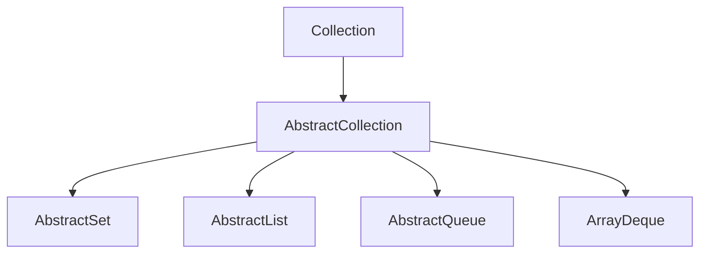

# AbstractCollection

## 1. 介绍

`java.util.AbstractCollection`这个类提供了对接口`Collection`骨骼级的实现。



## 2. 方法

### 2.1 iterator

```java
public abstract Iterator<E> iterator();
```

返回一个迭代器对象

### 2.2 size

```java
public abstract int size();
```

返回集合大小

### 2.3 isEmpty

```java
public boolean isEmpty() {
        return size() == 0;
}
```

是否为空

### 2.4 contains

```java
    public boolean contains(Object o) {
        Iterator<E> it = iterator();
        if (o==null) {
            while (it.hasNext())
                if (it.next()==null)
                    return true;
        } else {
            while (it.hasNext())
                if (o.equals(it.next()))
                    return true;
        }
        return false;
    }

```

是否包含指定元素

### 2.5 toArray

```java
    public Object[] toArray() {
        // Estimate size of array; be prepared to see more or fewer elements
        Object[] r = new Object[size()];
        Iterator<E> it = iterator();
        for (int i = 0; i < r.length; i++) {
            if (! it.hasNext()) // fewer elements than expected
                return Arrays.copyOf(r, i);
            r[i] = it.next();
        }
        return it.hasNext() ? finishToArray(r, it) : r;
    }
```

把集合转成数组

```java
    public <T> T[] toArray(T[] a) {
        // Estimate size of array; be prepared to see more or fewer elements
        int size = size();
        T[] r = a.length >= size ? a :
                  (T[])java.lang.reflect.Array
                  .newInstance(a.getClass().getComponentType(), size);
        Iterator<E> it = iterator();

        for (int i = 0; i < r.length; i++) {
            if (! it.hasNext()) { // fewer elements than expected
                if (a == r) {
                    r[i] = null; // null-terminate
                } else if (a.length < i) {
                    return Arrays.copyOf(r, i);
                } else {
                    System.arraycopy(r, 0, a, 0, i);
                    if (a.length > i) {
                        a[i] = null;
                    }
                }
                return a;
            }
            r[i] = (T)it.next();
        }
        // more elements than expected
        return it.hasNext() ? finishToArray(r, it) : r;
    }
```

把集合转换为指定数组，上面的比较好理解，下面看一下`finishToArray`方法

```java
    private static <T> T[] finishToArray(T[] r, Iterator<?> it) {
        int i = r.length;
        while (it.hasNext()) {
            int cap = r.length;
            if (i == cap) {
                int newCap = cap + (cap >> 1) + 1;
                // overflow-conscious code
                if (newCap - MAX_ARRAY_SIZE > 0)
                    newCap = hugeCapacity(cap + 1);
                r = Arrays.copyOf(r, newCap);
            }
            r[i++] = (T)it.next();
        }
        // trim if overallocated
        return (i == r.length) ? r : Arrays.copyOf(r, i);
    }
    private static int hugeCapacity(int minCapacity) {
        if (minCapacity < 0) // overflow
            throw new OutOfMemoryError
                ("Required array size too large");
        return (minCapacity > MAX_ARRAY_SIZE) ?
            Integer.MAX_VALUE :
            MAX_ARRAY_SIZE;
    }
```

这里其实就做了一个扩容然后赋值的操作，只要是下标i和数组长度r.length相等时，就进行一次扩容，最后返回数组元素数量大小的一个数组。

### 2.6 add

```java
public boolean add(E e) {
        throw new UnsupportedOperationException();
    }
```

子类如果可以添加元素，需要重写add方法

### 2.7 remove

```java
    public boolean remove(Object o) {
        Iterator<E> it = iterator();
        if (o==null) {
            while (it.hasNext()) {
                if (it.next()==null) {
                    it.remove();
                    return true;
                }
            }
        } else {
            while (it.hasNext()) {
                if (o.equals(it.next())) {
                    it.remove();
                    return true;
                }
            }
        }
        return false;
    }
```

应用迭代器，移除某个元素

### 2.8 containsAll

```java
    public boolean containsAll(Collection<?> c) {
        for (Object e : c)
            if (!contains(e))
                return false;
        return true;
    }
```

是否包含指定数组的所有元素

### 2.9 addAll

```java
    public boolean addAll(Collection<? extends E> c) {
        boolean modified = false;
        for (E e : c)
            if (add(e))
                modified = true;
        return modified;
    }
```

循环调用add方法

### 2.10 removeAll

```java
    public boolean removeAll(Collection<?> c) {
        Objects.requireNonNull(c);
        boolean modified = false;
        Iterator<?> it = iterator();
        while (it.hasNext()) {
            if (c.contains(it.next())) {
                it.remove();
                modified = true;
            }
        }
        return modified;
    }
```

移除与入参集合相同的元素

### 2.11 retainAll

```java
    public boolean retainAll(Collection<?> c) {
        Objects.requireNonNull(c);
        boolean modified = false;
        Iterator<E> it = iterator();
        while (it.hasNext()) {
            if (!c.contains(it.next())) {
                it.remove();
                modified = true;
            }
        }
        return modified;
    }
```

保留与入参集合中元素相同的元素

### 2.12 clear

```java
    public void clear() {
        Iterator<E> it = iterator();
        while (it.hasNext()) {
            it.next();
            it.remove();
        }
    }
```

情况集合所有元素

### 2.13 toString

```java
    public String toString() {
        Iterator<E> it = iterator();
        if (! it.hasNext())
            return "[]";

        StringBuilder sb = new StringBuilder();
        sb.append('[');
        for (;;) {
            E e = it.next();
            sb.append(e == this ? "(this Collection)" : e);
            if (! it.hasNext())
                return sb.append(']').toString();
            sb.append(',').append(' ');
        }
    }
```

重写了toString方法