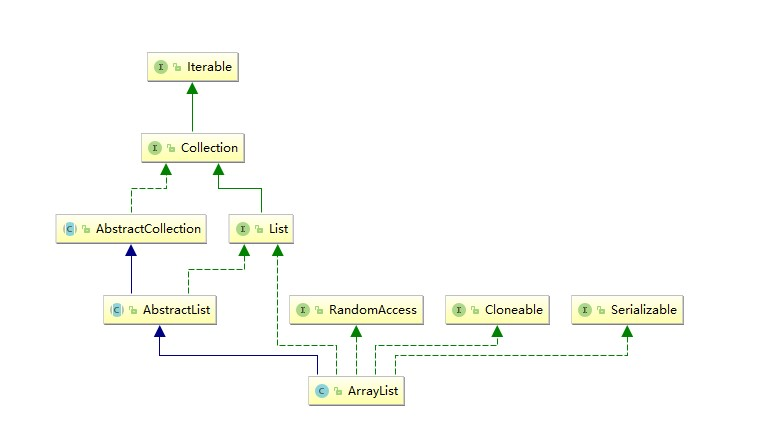

# ArrayList

## 1. 介绍

size、isEmpty、get、set、iterator、listIterator 常数时间

add   O(n)

其他的操作也在一个线性时间



## 2. 属性

### 2.1 DEFAULT_CAPACITY

默认容量10

```java
    private static final int DEFAULT_CAPACITY = 10;
```

### 2.2 EMPTY_ELEMENTDATA

用在空实例上，共享空数组实例

```java
    private static final Object[] EMPTY_ELEMENTDATA = {};
```

### 2.3 DEFAULTCAPACITY_EMPTY_ELEMENTDATA

用于默认尺寸大小的空实例，共享空数组实例，和2.2不同的地方是怎样取扩容（主要看下面代码）

```java
	private static final Object[] DEFAULTCAPACITY_EMPTY_ELEMENTDATA = {};
```

### 2.4 