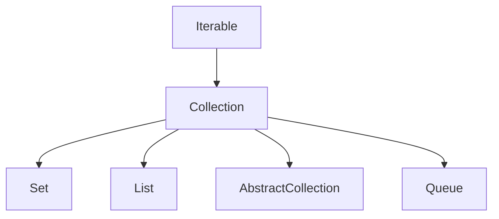

# Collection

## 1. 介绍

`java.util.Collection`是一个集合结构的根集合，jdk中没有提供直接的实现，提供了指定的子接口`List`、`Set`等，基于jdk11



## 2. 方法

### 2.1 size

```java
int size();
```

返回集合的数量，如果集合数量大于`Integer.MAX_VALUE`，返回`Integer.MAX_VALUE`

### 2.2 isEmpty

```java
boolean isEmpty();
```

如果集合不包含元素，返回`true`

### 2.3 contains

```java
 boolean contains(Object o);
```

如果集合包含指定的元素，返回`true`

### 2.4 iterator

```java
Iterator<E> iterator();
```

返回集合的迭代器

### 2.5 toArray

```
Object[] toArray();
```

返回一个数组

```java
<T> T[] toArray(T[] a);
```

返回`T[]`类型的数组，如果空间不够，会分配一个同类型的新数据，然后返回

```java
default <T> T[] toArray(IntFunction<T[]> generator) {
        return toArray(generator.apply(0));
    }
```

返回一个`T[]`类型的数组，通过这个函数式接口，例如Collection<String> x ：`String[] y = x.toArray(String[]::new);`

### 2.6 add

```java
boolean add(E e);
```

如果添加成功，集合改变了，返回true，如果集合不允许添加重复的元素，这个元素已经存在了，返回false，如果不是因为包含这个元素而拒绝添加，必须抛出异常，

### 2.7 remove

```java
boolean remove(Object o);
```

如果元素被移除成功了，返回true

### 2.8 containsAll

```
 boolean containsAll(Collection<?> c);
```

如果集合包含c中的所有元素，返回true

### 2.9 addAll

```
boolean addAll(Collection<? extends E> c);
```

把c集合元素添加到当前集合中，如果当前操作正在运行中，c发生了改变，这个结果是不确定的

### 2.10 removeAll

```java
boolean removeAll(Collection<?> c);
```

移除当前集合与c集合相同的元素

### 2.11 removeIf

```
    default boolean removeIf(Predicate<? super E> filter) {
        Objects.requireNonNull(filter);
        boolean removed = false;
        final Iterator<E> each = iterator();
        while (each.hasNext()) {
            if (filter.test(each.next())) {
                each.remove();
                removed = true;
            }
        }
        return removed;
    }
```

入参是Predicate类型的函数式接口，移除符合条件的元素

### 2.12 retailAll

```java
boolean retainAll(Collection<?> c);
```

保留与c集合相同的元素，如果集合发生改变，返回true

### 2.13 clear

```java
void clear();
```

清空所有元素

### 2.14 equals

```java
boolean equals(Object o);
```

比较两个对象是否相等

### 2.15 hashCode

```
int hashCode();
```

返回hashCode

### 2.16 spliterator

```java
default Spliterator<E> spliterator() {
        return Spliterators.spliterator(this, 0);
    }
```

返回一个分割迭代器对象

### 2.17 stream

```java
default Stream<E> stream() {
        return StreamSupport.stream(spliterator(), false);
    }
```

返回非并行的Stream对象

### 2.18 parallelStream

```java
default Stream<E> parallelStream() {
        return StreamSupport.stream(spliterator(), true);
    }
```

可能返回并行的Stream，也允许返回非并行的stream

