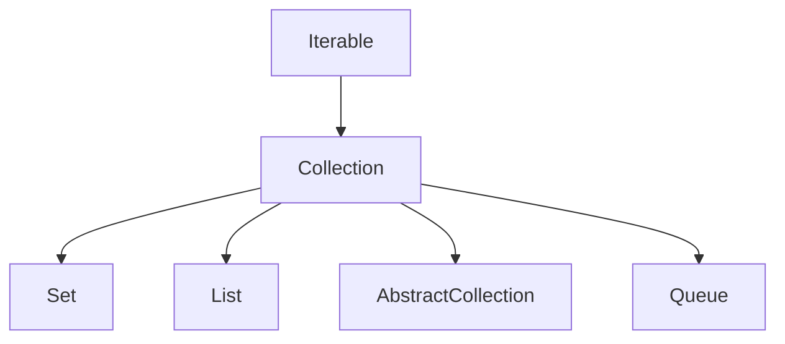

# Collection

## 1. 介绍

`java.util.Collection`是一个集合结构的根集合，jdk中没有提供直接的实现，提供了指定的子接口`List`、`Set`等



## 2. 方法

### 2.1 size

```java
int size();
```

返回集合的数量，如果集合数量大于`Integer.MAX_VALUE`，返回`Integer.MAX_VALUE`

### 2.2 isEmpty


