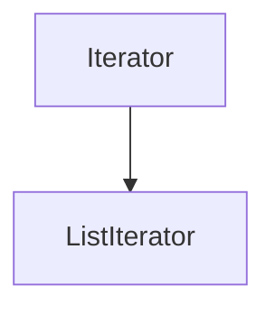

# ListIterator<E>

## 1. 介绍

它是一个list迭代器，允许开发者向前或者向后去遍历一个list、修改一个list、获取迭代器在list中的位置。listIterator没有当前元素，它的位置游标在pre元素与next元素之间，所以一个长度为`n`的list的listIterator有`n+1`个可能的位置游标。

注意`remove`和`set`方法不是依赖于当前游标位置，它依赖于最后一次操作的返回元素，可能是`next`方法，也可能是`previous`方法。



## 2. 方法

### 2.1 hasNext

```java
boolean hasNext();
```

如果这个list迭代器在前进方向上还有其它的元素，返回`true`

### 2.2 next

```java
E next();
```

返回集合的下一个元素，并且使当前游标位置前进一个位置

### 2.3 hasPrevious

```java
boolean hasPrevious();
```

如果这个list迭代器在反向方向上还有其它的元素，返回`true`

### 2.4 previous

```java
E previous();
```

返回集合的上一个元素，并且使当前游标位置后退一个位置

### 2.5 nextIndex

```java
int nextIndex();
```

返回下一个游标的索引，如果在list集合的末尾，则返回集合长度

### 2.6 previousIndex

```java
int previousIndex();
```

返回上一个位置的索引，如果在集合的开始位置，则返回-1

### 2.7 remove

```java
void remove();
```

移除最后一次调用`next`方法或者`previous`方法返回的元素，对于当前调用者来说，对一个元素只能调用一次。

注意：如果最后一次调用的是add，则会抛出`IllegalStateException`异常

### 2.8 set

```java
void set(E e);
```

替换最后一次调用next或者previous的元素，如果最后一次调用的是add或者是remove，将会抛出`IllegalStateException`异常

### 2.9 add

```java
void add(E e);
```

在next和previous元素之间插入一个值，不会影响调用next()方法，如果调用previous()方法，会返回这个新的元素