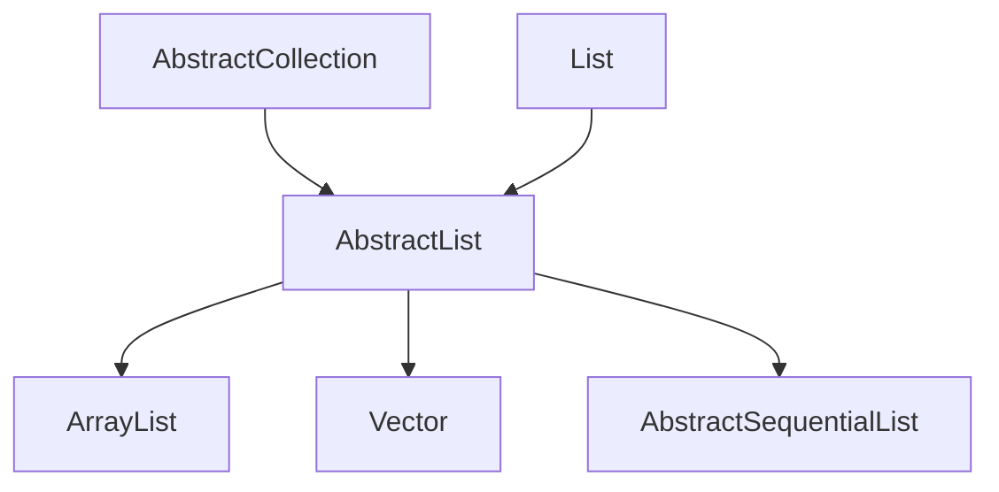

# AbstractList<E>

## 1. 介绍

AbstractList实现了List的一个骨骼级的实现，如果要实现不可修改的list，程序需要去扩展这个类，实现`get`和`size`方法；如果要实现可修改的list，必须额外实现`set`方法，如果集合的大小也可以改变，还需要实现`add`和`remove`方法。`iterator`和`list iterator`已经在这个类实现好了。



## 2. add

```java
public boolean add(E e) {
    add(size(), e);
    return true;
}
```

添加元素到集合的末尾


## 3. get

```java
    public abstract E get(int index);
```

根据索引获取元素

## 4. set

```java
public E set(int index, E element) {
    throw new UnsupportedOperationException();
}
```

在index位置设置元素element，覆盖原来的元素

## 5. add

```java
public void add(int index, E element) {
    throw new UnsupportedOperationException();
}
```

在index添加元素element

## 6.remove

```java
public E remove(int index) {
    throw new UnsupportedOperationException();
}
```

移除某个索引位置的元素

## 7. indexOf

```java
    public int indexOf(Object o) {
        ListIterator<E> it = listIterator();
        if (o==null) {
            while (it.hasNext())
                if (it.next()==null)
                    return it.previousIndex();
        } else {
            while (it.hasNext())
                if (o.equals(it.next()))
                    return it.previousIndex();
        }
        return -1;
    }
```

从其实位置搜索元素o，如果当前集合不包含此元素，返回-1

## 8. lastIndexOf

```java
    public int lastIndexOf(Object o) {
        ListIterator<E> it = listIterator(size());
        if (o==null) {
            while (it.hasPrevious())
                if (it.previous()==null)
                    return it.nextIndex();
        } else {
            while (it.hasPrevious())
                if (o.equals(it.previous()))
                    return it.nextIndex();
        }
        return -1;
    }
```

最后一次出现元素o的位置，初始化ListIterator时，加入游标位置为末尾。

## 9. clear

```java
    public void clear() {
        removeRange(0, size());
    }
```

清空所有元素

## 10. addAll

```java
    public boolean addAll(int index, Collection<? extends E> c) {
        rangeCheckForAdd(index);
        boolean modified = false;
        for (E e : c) {
            add(index++, e);
            modified = true;
        }
        return modified;
    }
    private void rangeCheckForAdd(int index) {
        if (index < 0 || index > size())
            throw new IndexOutOfBoundsException(outOfBoundsMsg(index));
    }
  	private String outOfBoundsMsg(int index) {
        return "Index: "+index+", Size: "+size();
    }

```

在索引位置加入集合c

## 11. iterator

```
    public Iterator<E> iterator() {
        return new Itr();
    }
```

返回当前集合的迭代器，下面看一下迭代器的实现

```java
private class Itr implements Iterator<E> {

    int cursor = 0;

    int lastRet = -1;

    int expectedModCount = modCount;

    public boolean hasNext() {
        return cursor != size();
    }

    public E next() {
        checkForComodification();
        try {
            int i = cursor;
            E next = get(i);
            lastRet = i;
            cursor = i + 1;
            return next;
        } catch (IndexOutOfBoundsException e) {
            checkForComodification();
            throw new NoSuchElementException();
        }
    }

    public void remove() {
        if (lastRet < 0)
            throw new IllegalStateException();
        checkForComodification();

        try {
            AbstractList.this.remove(lastRet);
            if (lastRet < cursor)
                cursor--;
            lastRet = -1;
            expectedModCount = modCount;
        } catch (IndexOutOfBoundsException e) {
            throw new ConcurrentModificationException();
        }
    }

    final void checkForComodification() {
        if (modCount != expectedModCount)
            throw new ConcurrentModificationException();
    }
}
```

Iterator时单项向下循环

`cursor`: 游标的位置

`lastRet`: 最后一次调用next或者previous(在ListIterator中)的位置，如果调用了remove，会置为-1

`expectedModCount`: 修改次数，用来监测是否有并发修改

`hasNext()`: 是否到达集合末尾，用来判断是否还有下一个元素

`next()`: 返回当前游标cursor的元素，并把lastRet置为当前元素的游标位置，然后游标+1。在调用next前一定要先调用hasNext否则可能出现越界

`remove()`:移除lastRet所指向的元素，如果为-1时，会抛出异常。如果移除的元素在游标前面，则游标-1，然后lastRet置为-1，重新赋值修改次数expectedModCount

`checkForComodification()`: 如果在操作过程中，集合结构发生变化，会抛出`ConcurrentModificationException`异常

## 12. listIterator

```java
    public ListIterator<E> listIterator() {
        return listIterator(0);
    }

    public ListIterator<E> listIterator(final int index) {
        rangeCheckForAdd(index);

        return new ListItr(index);
    }
```

返回list迭代器，index为游标的位置，下面看看ListIterator的实现

```java
private class ListItr extends Itr implements ListIterator<E> {
    ListItr(int index) {
        cursor = index;
    }

    public boolean hasPrevious() {
        return cursor != 0;
    }

    public E previous() {
        checkForComodification();
        try {
            int i = cursor - 1;
            E previous = get(i);
            lastRet = cursor = i;
            return previous;
        } catch (IndexOutOfBoundsException e) {
            checkForComodification();
            throw new NoSuchElementException();
        }
    }

    public int nextIndex() {
        return cursor;
    }

    public int previousIndex() {
        return cursor-1;
    }

    public void set(E e) {
        if (lastRet < 0)
            throw new IllegalStateException();
        checkForComodification();

        try {
            AbstractList.this.set(lastRet, e);
            expectedModCount = modCount;
        } catch (IndexOutOfBoundsException ex) {
            throw new ConcurrentModificationException();
        }
    }

    public void add(E e) {
        checkForComodification();

        try {
            int i = cursor;
            AbstractList.this.add(i, e);
            lastRet = -1;
            cursor = i + 1;
            expectedModCount = modCount;
        } catch (IndexOutOfBoundsException ex) {
            throw new ConcurrentModificationException();
        }
    }
}
```

`ListItr`继承了Itr实现了ListIterator，游标可以向前向后移动。Itr中向后移动与删除功能已经实现了，这里主要实现了游标向前移动的操作。 在ListIterator中说明，游标是介于next与previous元素之间的，但这里的实现用了一个技巧，游标其实指向了next的位置，游标-1为previous的元素，因为在Itr实现中，每一次调用next先获取当前游标的元素，然后游标+1，相当于上一个元素位置就是当前游标-1。

`ListItr(int index)`: 构造方法，设置游标的位置

`hasPrevious`：判断是否有上一个元素，如果当前游标位置为0，就没有上一个元素

`previous`：返回上一个元素（当前游标-1位置的元素），然后重新赋值cursor与lastRet的值

`nextIndex`: 返回下一个元素游标的位置

`previousIndex`:返回上一个游标的位置

`set`: 在lastRet上设置值，然后重新给expectedModCount赋值

`add`: 在当前游标位置添加元素，然后lastRet置为-1，游标+1，重新给expectedModCount赋值，添加元素以后不会影响next返回的值，但是调用previous会返回当前添加的元素

## 13. equals

```java
public boolean equals(Object o) {
    if (o == this)
        return true;
    if (!(o instanceof List))
        return false;

    ListIterator<E> e1 = listIterator();
    ListIterator<?> e2 = ((List<?>) o).listIterator();
    while (e1.hasNext() && e2.hasNext()) {
        E o1 = e1.next();
        Object o2 = e2.next();
        if (!(o1==null ? o2==null : o1.equals(o2)))
            return false;
    }
    return !(e1.hasNext() || e2.hasNext());
}
```

比较两个集合是否相等

- 先判断是否是当前元素
- 类型是否一样
- 挨个元素比较
- 最后一步可以看成长度是否一样

## 14. hashCode

```java
    public int hashCode() {
        int hashCode = 1;
        for (E e : this)
            hashCode = 31*hashCode + (e==null ? 0 : e.hashCode());
        return hashCode;
    }
```

计算hashCode

## 15. removeRange

```java
    protected void removeRange(int fromIndex, int toIndex) {
        ListIterator<E> it = listIterator(fromIndex);
        for (int i=0, n=toIndex-fromIndex; i<n; i++) {
            it.next();
            it.remove();
        }
    }
```

移除范围，左闭右开区间

## 16. modCount

```java
    protected transient int modCount = 0;
```

标志修改次数

## 17.RandomAccessSpliterator

```java
static final class RandomAccessSpliterator<E> implements Spliterator<E> {

    private final List<E> list;
    private int index; // current index, modified on advance/split
    private int fence; // -1 until used; then one past last index

    // The following fields are valid if covering an AbstractList
    private final AbstractList<E> alist;
    private int expectedModCount; // initialized when fence set

    RandomAccessSpliterator(List<E> list) {
        assert list instanceof RandomAccess;

        this.list = list;
        this.index = 0;
        this.fence = -1;

        this.alist = list instanceof AbstractList ? (AbstractList<E>) list : null;
        this.expectedModCount = alist != null ? alist.modCount : 0;
    }

    /** Create new spliterator covering the given  range */
    private RandomAccessSpliterator(RandomAccessSpliterator<E> parent,
                            int origin, int fence) {
        this.list = parent.list;
        this.index = origin;
        this.fence = fence;

        this.alist = parent.alist;
        this.expectedModCount = parent.expectedModCount;
    }

    private int getFence() { // initialize fence to size on first use
        int hi;
        List<E> lst = list;
        if ((hi = fence) < 0) {
            if (alist != null) {
                expectedModCount = alist.modCount;
            }
            hi = fence = lst.size();
        }
        return hi;
    }

    public Spliterator<E> trySplit() {
        int hi = getFence(), lo = index, mid = (lo + hi) >>> 1;
        return (lo >= mid) ? null : // divide range in half unless too small
                new RandomAccessSpliterator<>(this, lo, index = mid);
    }

    public boolean tryAdvance(Consumer<? super E> action) {
        if (action == null)
            throw new NullPointerException();
        int hi = getFence(), i = index;
        if (i < hi) {
            index = i + 1;
            action.accept(get(list, i));
            checkAbstractListModCount(alist, expectedModCount);
            return true;
        }
        return false;
    }

    public void forEachRemaining(Consumer<? super E> action) {
        Objects.requireNonNull(action);
        List<E> lst = list;
        int hi = getFence();
        int i = index;
        index = hi;
        for (; i < hi; i++) {
            action.accept(get(lst, i));
        }
        checkAbstractListModCount(alist, expectedModCount);
    }

    public long estimateSize() {
        return (long) (getFence() - index);
    }

    public int characteristics() {
        return Spliterator.ORDERED | Spliterator.SIZED | Spliterator.SUBSIZED;
    }

    private static <E> E get(List<E> list, int i) {
        try {
            return list.get(i);
        } catch (IndexOutOfBoundsException ex) {
            throw new ConcurrentModificationException();
        }
    }

    static void checkAbstractListModCount(AbstractList<?> alist, int expectedModCount) {
        if (alist != null && alist.modCount != expectedModCount) {
            throw new ConcurrentModificationException();
        }
    }
}
```

随机访问的可分割迭代器，具体可看`Spliterator`

## 18. SubList

```java
private static class SubList<E> extends AbstractList<E> {
    private final AbstractList<E> root;
    private final SubList<E> parent;
    private final int offset;
    protected int size;

    /**
     * Constructs a sublist of an arbitrary AbstractList, which is
     * not a SubList itself.
     */
    public SubList(AbstractList<E> root, int fromIndex, int toIndex) {
        this.root = root;
        this.parent = null;
        this.offset = fromIndex;
        this.size = toIndex - fromIndex;
        this.modCount = root.modCount;
    }

    /**
     * Constructs a sublist of another SubList.
     */
    protected SubList(SubList<E> parent, int fromIndex, int toIndex) {
        this.root = parent.root;
        this.parent = parent;
        this.offset = parent.offset + fromIndex;
        this.size = toIndex - fromIndex;
        this.modCount = root.modCount;
    }

    public E set(int index, E element) {
        Objects.checkIndex(index, size);
        checkForComodification();
        return root.set(offset + index, element);
    }

    public E get(int index) {
        Objects.checkIndex(index, size);
        checkForComodification();
        return root.get(offset + index);
    }

    public int size() {
        checkForComodification();
        return size;
    }

    public void add(int index, E element) {
        rangeCheckForAdd(index);
        checkForComodification();
        root.add(offset + index, element);
        updateSizeAndModCount(1);
    }

    public E remove(int index) {
        Objects.checkIndex(index, size);
        checkForComodification();
        E result = root.remove(offset + index);
        updateSizeAndModCount(-1);
        return result;
    }

    protected void removeRange(int fromIndex, int toIndex) {
        checkForComodification();
        root.removeRange(offset + fromIndex, offset + toIndex);
        updateSizeAndModCount(fromIndex - toIndex);
    }

    public boolean addAll(Collection<? extends E> c) {
        return addAll(size, c);
    }

    public boolean addAll(int index, Collection<? extends E> c) {
        rangeCheckForAdd(index);
        int cSize = c.size();
        if (cSize==0)
            return false;
        checkForComodification();
        root.addAll(offset + index, c);
        updateSizeAndModCount(cSize);
        return true;
    }

    public Iterator<E> iterator() {
        return listIterator();
    }

    public ListIterator<E> listIterator(int index) {
        checkForComodification();
        rangeCheckForAdd(index);

        return new ListIterator<E>() {
            private final ListIterator<E> i =
                    root.listIterator(offset + index);

            public boolean hasNext() {
                return nextIndex() < size;
            }

            public E next() {
                if (hasNext())
                    return i.next();
                else
                    throw new NoSuchElementException();
            }

            public boolean hasPrevious() {
                return previousIndex() >= 0;
            }

            public E previous() {
                if (hasPrevious())
                    return i.previous();
                else
                    throw new NoSuchElementException();
            }

            public int nextIndex() {
                return i.nextIndex() - offset;
            }

            public int previousIndex() {
                return i.previousIndex() - offset;
            }

            public void remove() {
                i.remove();
                updateSizeAndModCount(-1);
            }

            public void set(E e) {
                i.set(e);
            }

            public void add(E e) {
                i.add(e);
                updateSizeAndModCount(1);
            }
        };
    }

    public List<E> subList(int fromIndex, int toIndex) {
        subListRangeCheck(fromIndex, toIndex, size);
        return new SubList<>(this, fromIndex, toIndex);
    }

    private void rangeCheckForAdd(int index) {
        if (index < 0 || index > size)
            throw new IndexOutOfBoundsException(outOfBoundsMsg(index));
    }

    private String outOfBoundsMsg(int index) {
        return "Index: "+index+", Size: "+size;
    }

    private void checkForComodification() {
        if (root.modCount != this.modCount)
            throw new ConcurrentModificationException();
    }

    private void updateSizeAndModCount(int sizeChange) {
        SubList<E> slist = this;
        do {
            slist.size += sizeChange;
            slist.modCount = root.modCount;
            slist = slist.parent;
        } while (slist != null);
    }
}
```

截取集合，实际根本就没有返回新集合，还是原来的集合，根据构造函数fromIndex,toIndex设置了偏移量offset=fromIndex,和size=toIndex-fromIndex。每次还是操作的原集合，只不过加了一个偏移量offset。

## 19. RandomAccessSubList

```java
private static class RandomAccessSubList<E>
        extends SubList<E> implements RandomAccess {

    /**
     * Constructs a sublist of an arbitrary AbstractList, which is
     * not a RandomAccessSubList itself.
     */
    RandomAccessSubList(AbstractList<E> root,
            int fromIndex, int toIndex) {
        super(root, fromIndex, toIndex);
    }

    /**
     * Constructs a sublist of another RandomAccessSubList.
     */
    RandomAccessSubList(RandomAccessSubList<E> parent,
            int fromIndex, int toIndex) {
        super(parent, fromIndex, toIndex);
    }

    public List<E> subList(int fromIndex, int toIndex) {
        subListRangeCheck(fromIndex, toIndex, size);
        return new RandomAccessSubList<>(this, fromIndex, toIndex);
    }
}
```

随机访问截取集合，实际就是用的`SubList`

## 20. subList

```java
    public List<E> subList(int fromIndex, int toIndex) {
        subListRangeCheck(fromIndex, toIndex, size());
        return (this instanceof RandomAccess ?
                new RandomAccessSubList<>(this, fromIndex, toIndex) :
                new SubList<>(this, fromIndex, toIndex));
    }
    static void subListRangeCheck(int fromIndex, int toIndex, int size) {
        if (fromIndex < 0)
            throw new IndexOutOfBoundsException("fromIndex = " + fromIndex);
        if (toIndex > size)
            throw new IndexOutOfBoundsException("toIndex = " + toIndex);
        if (fromIndex > toIndex)
            throw new IllegalArgumentException("fromIndex(" + fromIndex +
                                               ") > toIndex(" + toIndex + ")");
    }
```

截取集合，根据18/19两个内部类，判断是否有随机访问标志，调用不同的实现