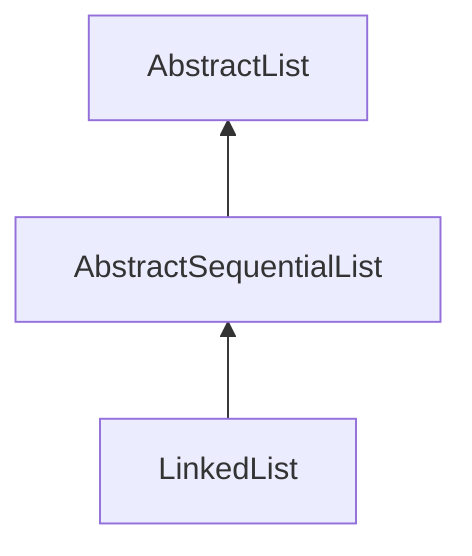

# AbstractSequentialList

这个类提供了依靠顺序`sequential access`访问数据存储的list的框架级实现，如果时随机访问` random access`，应该优先继承`AbstractList`。这个类中的所有操作都是通过操作`listIterator`来实现的。




- get

  ```java
      public E get(int index) {
          try {
              return listIterator(index).next();
          } catch (NoSuchElementException exc) {
              throw new IndexOutOfBoundsException("Index: "+index);
          }
      }
  ```

  通过listIterator返回指定位置的元素

- set

```java
    public E set(int index, E element) {
        try {
            ListIterator<E> e = listIterator(index);
            E oldVal = e.next();
            e.set(element);
            return oldVal;
        } catch (NoSuchElementException exc) {
            throw new IndexOutOfBoundsException("Index: "+index);
        }
    }
```

取代指定位置的元素，返回原来的值

- add

```java
    public void add(int index, E element) {
        try {
            listIterator(index).add(element);
        } catch (NoSuchElementException exc) {
            throw new IndexOutOfBoundsException("Index: "+index);
        }
    }
```

- remove

```java
    public E remove(int index) {
        try {
            ListIterator<E> e = listIterator(index);
            E outCast = e.next();
            e.remove();
            return outCast;
        } catch (NoSuchElementException exc) {
            throw new IndexOutOfBoundsException("Index: "+index);
        }
    }

```

- addAll

```java
    public boolean addAll(int index, Collection<? extends E> c) {
        try {
            boolean modified = false;
            ListIterator<E> e1 = listIterator(index);
            for (E e : c) {
                e1.add(e);
                modified = true;
            }
            return modified;
        } catch (NoSuchElementException exc) {
            throw new IndexOutOfBoundsException("Index: "+index);
        }
    }
```

- iterator

  ```java
     public Iterator<E> iterator() {
          return listIterator();
      }
  ```

  返回AbstractList中的迭代器

- listIterator

```java
    public abstract ListIterator<E> listIterator(int index);
```

返回迭代器，设置当前游标位置