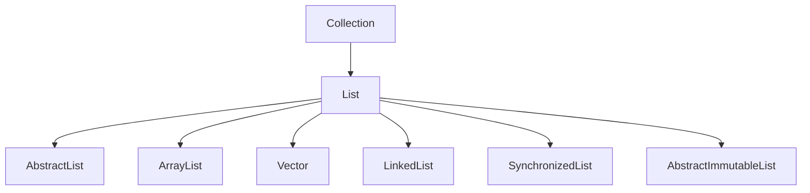

# List

## 1 介绍

`java.util.List`  一个有序的集合，有序指的是插入顺序不会变。集合是允许重复的。提供了快速创建不可变集合的方法，不可变集合中的元素不能为空。下面介绍一些List接口有Collection接口没有的方法(基于jdk11源码)



## 2 方法

### 2.1 addAll

```java
boolean addAll(int index, Collection<? extends E> c);
```

在index位置插入元素

### 2.2 replaceAll

```java
   default void replaceAll(UnaryOperator<E> operator) {
        Objects.requireNonNull(operator);
        final ListIterator<E> li = this.listIterator();
        while (li.hasNext()) {
            li.set(operator.apply(li.next()));
        }
    }
```

对于集合中每个元素，都用函数式接口传过来的operator处理一下，然后取代原来元素，这是对所有元素进行同意处理的特别好的方法，jdk1.8加入的。


### 2.3 sort

```java
    default void sort(Comparator<? super E> c) {
        Object[] a = this.toArray();
        Arrays.sort(a, (Comparator) c);
        ListIterator<E> i = this.listIterator();
        for (Object e : a) {
            i.next();
            i.set((E) e);
        }
    }
```

对集合内元素进行排序，1.传入一个比较的函数式接口，2.把当前集合转成数组，3.进行排序， 4. 把排序后的元素一个一个赋值到原来集合中

### 2.4 get

```java
E get(int index);
```

返回某个位置的元素

### 2.5 set

```java
E set(int index, E element);
```

用指定的元素取代某个位置的元素

### 2.3 add

```java
void add(int index, E element);
```

在某个位置插入一个元素

### 2.4 remove

```java
E remove(int index);
```

移除某个位置的元素

### 2.5 indexOf

```java
int indexOf(Object o);
```

返回第一个发现指定元素的职位，如果没找到则返回-1

### 2.6 lastIndexOf

```java
int lastIndexOf(Object o);
```

返回指定元素最后一次出现的位置，否则返回-1

### 2.7 listIterator

```java
ListIterator<E> listIterator();
```

返回一个list迭代器

### 2.8 subList

```java
List<E> subList(int fromIndex, int toIndex);
```

返回在此区间的序列，左闭右开区间

### 2.9 of

```java
    static <E> List<E> of(E... elements) {
        switch (elements.length) { // implicit null check of elements
            case 0:
                return ImmutableCollections.emptyList();
            case 1:
                return new ImmutableCollections.List12<>(elements[0]);
            case 2:
                return new ImmutableCollections.List12<>(elements[0], elements[1]);
            default:
                return new ImmutableCollections.ListN<>(elements);
        }
    }
```

返回不可变集合(jdk9)

### 2.10 copyOf

```java
    static <E> List<E> copyOf(Collection<? extends E> coll) {
        return ImmutableCollections.listCopy(coll);
    }
```

根据输入的参数集合，返回一个不可变的集合（jdk10）