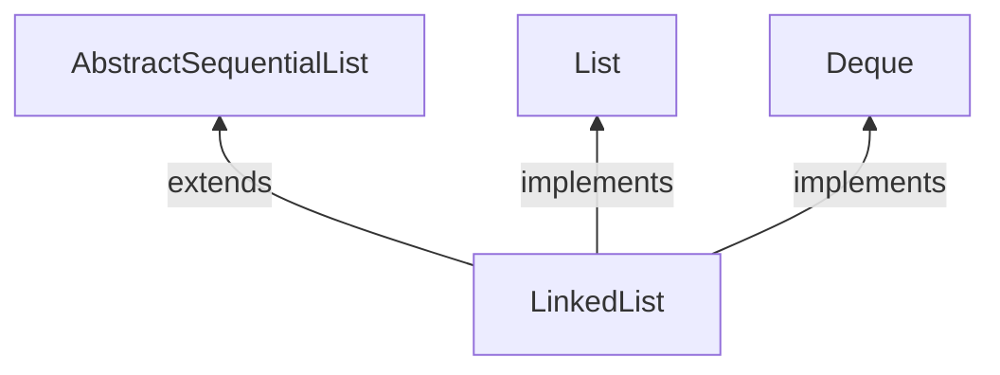

# LinkedList

## 介绍

  上一篇中ArrayDeque为数组实现的Deque，LinkedList为用链表实现的。

1. 双链表实现了List和Deque接口，允许元素为null
2. 不是线程安全的
3. 如果iterator已经构建，不通过iterator的remove或者add来改变链表，iterator将会抛出一个异常`ConcurrentModificationException`




## 源码分析

- 类中有三个变量

  ```java
      transient int size = 0;
  
      transient Node<E> first;
  
      transient Node<E> last;
  ```

  `first`指向链表的头

  `last`指向链表的尾

  看一下`Node`对象的构造

  ```java
      private static class Node<E> {
          E item;
          Node<E> next;
          Node<E> prev;
  
          Node(Node<E> prev, E element, Node<E> next) {
              this.item = element;
              this.next = next;
              this.prev = prev;
          }
      }
  ```

  `item`用来存储值的，`next`指向链表的下一个节点，`prev`指向链表的上一个节点，如果不是循环链表链表的头prev为null，链表的尾next为null

- `linkFirst`方法，在头部添加元素

  ```java
      private void linkFirst(E e) {
          final Node<E> f = first;
          final Node<E> newNode = new Node<>(null, e, f);
          first = newNode;
          if (f == null)
              last = newNode;
          else
              f.prev = newNode;
          size++;
          modCount++;
      }
  ```


  1. 创建一个newNode，newNode的next指向原来的头部元素，prev为null
  2. 另头部指针first指向newNode，newNode此时为新的头部元素
  3. 如果原来头部first为null，表示链表为null,此元素是链表第一个元素，此时尾部指针也指向这个元素
  4. 如果列表不为null，另原来头部元素的prev指向新添加的元素，构成双向链表
  5. 修改元素大小，修改修改的次数

- `linkLast`方法，在尾部添加元素

  ```
      void linkLast(E e) {
          final Node<E> l = last;
          final Node<E> newNode = new Node<>(l, e, null);
          last = newNode;
          if (l == null)
              first = newNode;
          else
              l.next = newNode;
          size++;
          modCount++;
      }
  ```

  1. 创建一个newNode，newNode的next为null，prev指向原来的尾部元素
  2. 另尾部指针指向新添加的元素
  3. 如果原来链表last为null，表示是空链表，此时头部也指向这个新添加的元素
  4. 如果原来链表不为null，原来链表尾部元素指向新添加的这个元素，构成双向链表
  5. 修改元素大小，修改修改的次数

- linkBefore方法，在某个元素前插入元素

  ```java
   void linkBefore(E e, Node<E> succ) {
          // assert succ != null;
          final Node<E> pred = succ.prev;
          final Node<E> newNode = new Node<>(pred, e, succ);
          succ.prev = newNode;
          if (pred == null)
              first = newNode;
          else
              pred.next = newNode;
          size++;
          modCount++;
      }
  ```

  入参表示，`e`要插入在`succ`节点之前

  1. 首先拿到`succ`节点的前一个节点`pred`
  2. 构造newNode对象，另新元素的next指向`succ`节点，prev指向`pred节点`，succ的prev指向新插入的节点
  3. 如果pred节点为null，表示succ节点为头结点，此时另头指针first指向新的节点
  4. 如果pred不为null，另pred的next指向新节点，通过2,3,4三步，把元素插入进来，构造成了一个双向链表
  5. 修改元素大小，修改修改的次数

- removeFirst方法，弹出头部元素

  ```java
  public E removeFirst() {
          final Node<E> f = first;
          if (f == null)
              throw new NoSuchElementException();
          return unlinkFirst(f);
      }
  private E unlinkFirst(Node<E> f) {
          // assert f == first && f != null;
          final E element = f.item;
          final Node<E> next = f.next;
          f.item = null;
          f.next = null; // help GC
          first = next;
          if (next == null)
              last = null;
          else
              next.prev = null;
          size--;
          modCount++;
          return element;
      }
  ```

  1. 首先拿到头部指针，判空一下，链表是否有元素，调用unlinkFirst方法，入参为头部指针的引用
  2. 获取头部指针的下一个节点，把头部指针的next指向空，item指向null（为了GC）
  3. 然后另头部指针first指向第二个节点，这样第二个节点就变成了头部节点
  4. 如果节点为null，证明原来链表只有一个元素，此时last也赋值null
  5. 如果节点不为null，把头结点的prev赋值null
  6. 修改元素大小，修改修改的次数
  7. 返回弹出的头部元素

- removeLast方法，弹出尾部元素

  ```java
    public E removeLast() {
          final Node<E> l = last;
          if (l == null)
              throw new NoSuchElementException();
          return unlinkLast(l);
      }
    private E unlinkLast(Node<E> l) {
          // assert l == last && l != null;
          final E element = l.item;
          final Node<E> prev = l.prev;
          l.item = null;
          l.prev = null; // help GC
          last = prev;
          if (prev == null)
              first = null;
          else
              prev.next = null;
          size--;
          modCount++;
          return element;
      }
  ```

  removeLast与removeFirst类似，只不过是操作的尾部节点

- `addFirst` 里面调用的linkFirst

  ```java
     public void addFirst(E e) {
          linkFirst(e);
      }
  ```

- `addLast` 里面调用的linkLast

  ```java
  public void addLast(E e) {
          linkLast(e);
      }
  ```


- unlink方法，删除一个节点

  ```java
  E unlink(Node<E> x) {
          // assert x != null;
          final E element = x.item;
          final Node<E> next = x.next;
          final Node<E> prev = x.prev;
  
          if (prev == null) {
              first = next;
          } else {
              prev.next = next;
              x.prev = null;
          }
  
          if (next == null) {
              last = prev;
          } else {
              next.prev = prev;
              x.next = null;
          }
  
          x.item = null;
          size--;
          modCount++;
          return element;
      }
  ```

  1. 获得被删除节点的上一个节点与下一个节点
  2. 如果上一个节点为null，则把头指针指向next节点，否则上一个节点的next指向下一个节点的next，当前节点的prev赋值null
  3. 如果next节点为null，则把尾指针指向prev节点，否则把next节点的prev指向上一个节点，当前节点的next赋值null
  4. 当前节点的item赋值null，修改元素大小，修改修改的次数
  5. 返回删除的节点

- listIterator实现

```java
    private class ListItr implements ListIterator<E> {
        private Node<E> lastReturned;
        private Node<E> next;
        private int nextIndex;
        private int expectedModCount = modCount;

        ListItr(int index) {
            // assert isPositionIndex(index);
            next = (index == size) ? null : node(index);
            nextIndex = index;
        }

        public boolean hasNext() {
            return nextIndex < size;
        }

        public E next() {
            checkForComodification();
            if (!hasNext())
                throw new NoSuchElementException();

            lastReturned = next;
            next = next.next;
            nextIndex++;
            return lastReturned.item;
        }

        public boolean hasPrevious() {
            return nextIndex > 0;
        }

        public E previous() {
            checkForComodification();
            if (!hasPrevious())
                throw new NoSuchElementException();

            lastReturned = next = (next == null) ? last : next.prev;
            nextIndex--;
            return lastReturned.item;
        }

        public int nextIndex() {
            return nextIndex;
        }

        public int previousIndex() {
            return nextIndex - 1;
        }

        public void remove() {
            checkForComodification();
            if (lastReturned == null)
                throw new IllegalStateException();

            Node<E> lastNext = lastReturned.next;
            unlink(lastReturned);
            if (next == lastReturned)
                next = lastNext;
            else
                nextIndex--;
            lastReturned = null;
            expectedModCount++;
        }

        public void set(E e) {
            if (lastReturned == null)
                throw new IllegalStateException();
            checkForComodification();
            lastReturned.item = e;
        }

        public void add(E e) {
            checkForComodification();
            lastReturned = null;
            if (next == null)
                linkLast(e);
            else
                linkBefore(e, next);
            nextIndex++;
            expectedModCount++;
        }

        public void forEachRemaining(Consumer<? super E> action) {
            Objects.requireNonNull(action);
            while (modCount == expectedModCount && nextIndex < size) {
                action.accept(next.item);
                lastReturned = next;
                next = next.next;
                nextIndex++;
            }
            checkForComodification();
        }

        final void checkForComodification() {
            if (modCount != expectedModCount)
                throw new ConcurrentModificationException();
        }
    }
```

- descendingIterator 

```java
    public Iterator<E> descendingIterator() {
        return new DescendingIterator();
    }
    private class DescendingIterator implements Iterator<E> {
        private final ListItr itr = new ListItr(size());
        public boolean hasNext() {
            return itr.hasPrevious();
        }
        public E next() {
            return itr.previous();
        }
        public void remove() {
            itr.remove();
        }
    }
```

倒序迭代器，其实用上面的listIterator实现的

- toArray

```java
    public Object[] toArray() {
        Object[] result = new Object[size];
        int i = 0;
        for (Node<E> x = first; x != null; x = x.next)
            result[i++] = x.item;
        return result;
    }
    public <T> T[] toArray(T[] a) {
        if (a.length < size)
            a = (T[])java.lang.reflect.Array.newInstance(
                                a.getClass().getComponentType(), size);
        int i = 0;
        Object[] result = a;
        for (Node<E> x = first; x != null; x = x.next)
            result[i++] = x.item;

        if (a.length > size)
            a[size] = null;

        return a;
    }
```

转换为数组，如果容量不够用，会重新创建一个数组

- spliterator

```java
 	public Spliterator<E> spliterator() {
        return new LLSpliterator<>(this, -1, 0);
    }

    static final class LLSpliterator<E> implements Spliterator<E> {
        static final int BATCH_UNIT = 1 << 10;  // batch array size increment
        static final int MAX_BATCH = 1 << 25;  // max batch array size;
        final LinkedList<E> list; // null OK unless traversed
        Node<E> current;      // current node; null until initialized
        int est;              // size estimate; -1 until first needed
        int expectedModCount; // initialized when est set
        int batch;            // batch size for splits

        LLSpliterator(LinkedList<E> list, int est, int expectedModCount) {
            this.list = list;
            this.est = est;
            this.expectedModCount = expectedModCount;
        }

        final int getEst() {
            int s; // force initialization
            final LinkedList<E> lst;
            if ((s = est) < 0) {
                if ((lst = list) == null)
                    s = est = 0;
                else {
                    expectedModCount = lst.modCount;
                    current = lst.first;
                    s = est = lst.size;
                }
            }
            return s;
        }

        public long estimateSize() { return (long) getEst(); }

        public Spliterator<E> trySplit() {
            Node<E> p;
            int s = getEst();
            if (s > 1 && (p = current) != null) {
                int n = batch + BATCH_UNIT;
                if (n > s)
                    n = s;
                if (n > MAX_BATCH)
                    n = MAX_BATCH;
                Object[] a = new Object[n];
                int j = 0;
                do { a[j++] = p.item; } while ((p = p.next) != null && j < n);
                current = p;
                batch = j;
                est = s - j;
                return Spliterators.spliterator(a, 0, j, Spliterator.ORDERED);
            }
            return null;
        }

        public void forEachRemaining(Consumer<? super E> action) {
            Node<E> p; int n;
            if (action == null) throw new NullPointerException();
            if ((n = getEst()) > 0 && (p = current) != null) {
                current = null;
                est = 0;
                do {
                    E e = p.item;
                    p = p.next;
                    action.accept(e);
                } while (p != null && --n > 0);
            }
            if (list.modCount != expectedModCount)
                throw new ConcurrentModificationException();
        }

        public boolean tryAdvance(Consumer<? super E> action) {
            Node<E> p;
            if (action == null) throw new NullPointerException();
            if (getEst() > 0 && (p = current) != null) {
                --est;
                E e = p.item;
                current = p.next;
                action.accept(e);
                if (list.modCount != expectedModCount)
                    throw new ConcurrentModificationException();
                return true;
            }
            return false;
        }

        public int characteristics() {
            return Spliterator.ORDERED | Spliterator.SIZED | Spliterator.SUBSIZED;
        }
    }
```

`trySplit`: 时转换成了数组