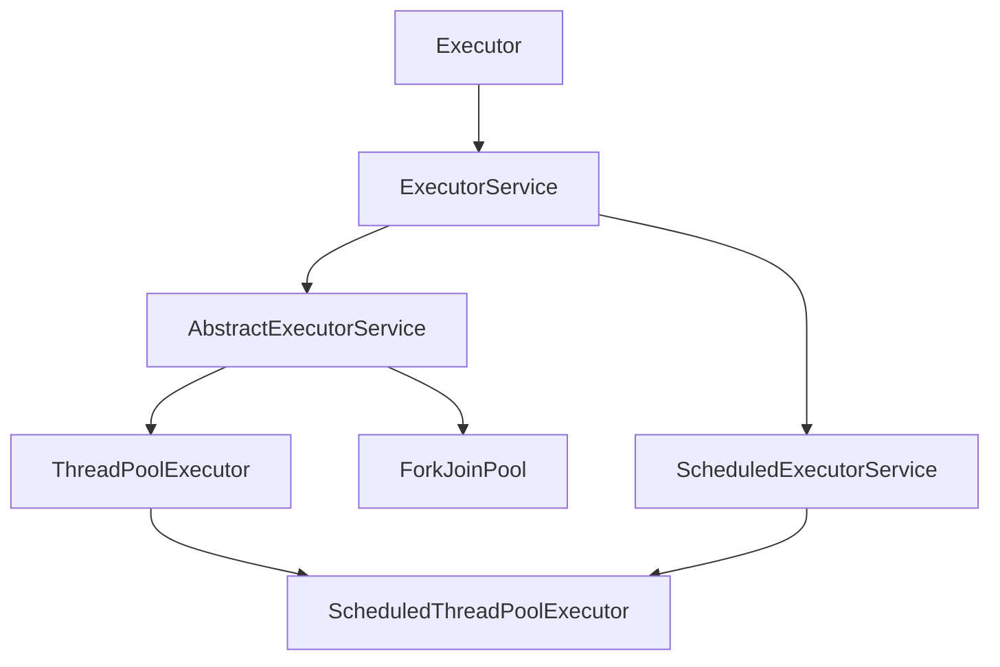
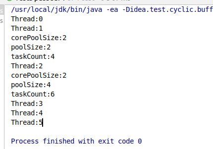

# ThreadPoolExecutor

## 1. 类继承关系



## 2. java代码

### 2.1 基本使用

 2个核心线程，队列最大存储2个，最大线程数4个

```java
	/**
     * 1<=线程<=2个  核心线程执行
     * 2<线程<=4个  入队列
     * 4<线程<=6  会再开两个线程执行
     * 6<线程  默认会抛出java.util.concurrent.RejectedExecutionException异常
     */
    @Test
    public void test01() throws Exception{
        AtomicInteger atomicInteger = new AtomicInteger();

        ThreadPoolExecutor executor = new ThreadPoolExecutor(2, 4, 0L, TimeUnit.SECONDS, new LinkedBlockingDeque<>(2));
        for(int i = 0;i<4;i++){
            executor.execute(()->{
                System.out.println("Thread:"+atomicInteger.getAndIncrement());

                try {
                    //模拟正在处理东西
                    Thread.sleep(5000);
                } catch (InterruptedException e) {
                    e.printStackTrace();
                }

            });
        }
        Thread.sleep(1000);
        System.out.println("corePoolSize:"+executor.getCorePoolSize());
        System.out.println("poolSize:"+executor.getPoolSize());
        System.out.println("taskCount:"+executor.getTaskCount());
        /*
        corePoolSize:2
        poolSize:2
        taskCount:4
         */


        for(int i = 0;i<2;i++){
            executor.execute(()->{
                System.out.println("Thread:"+atomicInteger.getAndIncrement());

                try {
                    //模拟正在处理东西
                    Thread.sleep(5000);
                } catch (InterruptedException e) {
                    e.printStackTrace();
                }

            });
        }
        System.out.println("corePoolSize:"+executor.getCorePoolSize());
        System.out.println("poolSize:"+executor.getPoolSize());
        System.out.println("taskCount:"+executor.getTaskCount());
        /**
         * corePoolSize:2
         * poolSize:4
         * taskCount:6
         */

        //再加入线程会报错
/*        for(int i = 0;i<2;i++){
            executor.execute(()->{
                System.out.println("Thread:"+atomicInteger.getAndIncrement());

                try {
                    //模拟正在处理东西
                    Thread.sleep(5000);
                } catch (InterruptedException e) {
                    e.printStackTrace();
                }

            });
        }*/

    }
```

输出结果：




### 2.2 拒绝策略

```java
package com.xhx.java;

import org.junit.Test;

import java.util.concurrent.*;
import java.util.concurrent.atomic.AtomicInteger;

public class TestRejectThreadPool {

    public static class MyTask implements Runnable{
        public MyTask(){
        }

        @Override
        public void run() {
            System.out.println("正在执行Thread:"+Thread.currentThread().getName());
            try {
                Thread.sleep(100);
            } catch (InterruptedException e) {
                e.printStackTrace();
            }
        }
    }

    /**
     * RejectedExecutionHandler
     * 自定义拒绝策略
     */
    @Test
    public void test01() throws Exception{
        MyTask task = new MyTask();
        ExecutorService es = new ThreadPoolExecutor(5, 5, 0L, TimeUnit.SECONDS,
                new SynchronousQueue<>(),
                Executors.defaultThreadFactory(),
                new RejectedExecutionHandler() {
                    @Override
                    public void rejectedExecution(Runnable r, ThreadPoolExecutor executor) {
                        System.out.println(r.toString()+" is discard");
                    }
                });
        for(int i = 0; i<Integer.MAX_VALUE;i++){
            es.submit(task);
            Thread.sleep(10);
        }
    }


    /**
     * ThreadPoolExecutor 自带4种拒绝策略，这里举例一种DiscardPolicy，具体看文档
     * @throws Exception
     */
    @Test
    public void test02() throws Exception {
        AtomicInteger atomicInteger = new AtomicInteger();

        ThreadPoolExecutor executor = new ThreadPoolExecutor(2, 2, 0L, TimeUnit.SECONDS, new SynchronousQueue<>(),
                new ThreadPoolExecutor.DiscardPolicy());

        for (int i = 0; i < 4; i++) {
            executor.execute(() -> {
                System.out.println("Thread:" + atomicInteger.getAndIncrement());

                try {
                    //模拟正在处理东西
                    Thread.sleep(3000);
                } catch (InterruptedException e) {
                    e.printStackTrace();
                }

            });
        }
        Thread.sleep(1000);
        System.out.println("corePoolSize:" + executor.getCorePoolSize());
        System.out.println("poolSize:" + executor.getPoolSize());
        System.out.println("taskCount:" + executor.getTaskCount());

        Thread.sleep(4000);
    }
}

```

### 2.3 扩展功能beforeExecute、afterExecute、terminated

```java
package com.xhx.java;

import org.junit.Test;

import java.util.concurrent.LinkedBlockingDeque;
import java.util.concurrent.ThreadPoolExecutor;
import java.util.concurrent.TimeUnit;

public class TestExtThreadPool {
    public static class MyTask implements Runnable{
        public String name;

        public MyTask(String name){
            this.name = name;
        }

        @Override
        public void run() {
            System.out.println("正在执行Thread:"+Thread.currentThread().getName());
            try {
                Thread.sleep(100);
            } catch (InterruptedException e) {
                e.printStackTrace();
            }
        }
    }

    /**
     * ThreadPoolExecutor
     * 可以重写一些方法
     * @throws Exception
     */
    @Test
    public void test01() throws Exception{
        ThreadPoolExecutor ex = new ThreadPoolExecutor(5, 5, 0L, TimeUnit.SECONDS, new LinkedBlockingDeque<Runnable>()) {
            @Override
            protected void beforeExecute(Thread t, Runnable r) {
                System.out.println("准备执行：" + ((MyTask) r).name);
            }

            @Override
            protected void afterExecute(Runnable r, Throwable t) {
                System.out.println("执行完成：" + ((MyTask) r).name);
            }

            @Override
            protected void terminated() {
                System.out.println("线程池退出");
            }
        };
        for(int i =0;i<5;i++){
            MyTask task = new MyTask("线程"+i);
            ex.execute(task);
            Thread.sleep(10);
        }
        ex.shutdown();
        Thread.sleep(1000);
    }
}

```

### 2.4 定时调度

```
package com.xhx.java;

import org.junit.Test;

import java.util.concurrent.*;
import java.util.stream.Stream;

/**
 * 可调度线程池
 */
public class TestScheduledThreadPool {

    /**
     * schedule 延时执行
     */
    @Test
    public void test02() throws Exception {
        ScheduledThreadPoolExecutor executor = new ScheduledThreadPoolExecutor(2);
        ScheduledFuture<Integer> resultFuture = executor.schedule(() ->
                Stream.iterate(1, i -> i = i + 1).limit(100).reduce(0, Integer::sum), 3, TimeUnit.SECONDS);
        //5050
        System.out.println(resultFuture.get());
    }


    /**
     * scheduleAtFixedRate 固定频率执行，
     * 可以参考Timer类原理，下次的执行时间是根据这次计算的执行时间算出来的，也就是lastExecuteTime+延时
     */
    @Test
    public void test03() throws Exception {
        ScheduledThreadPoolExecutor executor = new ScheduledThreadPoolExecutor(2);
        executor.scheduleAtFixedRate(() -> {
            Integer result = Stream.iterate(1, i -> i = i + 1).limit(100).reduce(0, Integer::sum);
            System.out.println(result);
        }, 3, 1, TimeUnit.SECONDS);

        Thread.sleep(20000);
    }

    /**
     * scheduleWithFixedDelay 固定延时执行
     * 可以参考Timer类原理，下次的执行时间是根据这次运行时的时间算出来的，也就是cuttrenTime+延时
     */
    @Test
    public void test04() throws Exception {
        ScheduledThreadPoolExecutor executor = new ScheduledThreadPoolExecutor(2);
        executor.scheduleWithFixedDelay(() -> {
            Integer result = Stream.iterate(1, i -> i = i + 1).limit(100).reduce(0, Integer::sum);
            System.out.println(result);

        }, 3, 1, TimeUnit.SECONDS);

        Thread.sleep(20000);
    }


}

```

