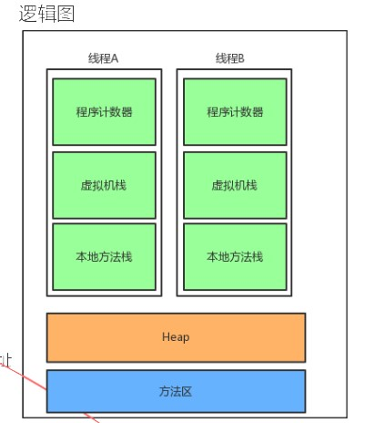

## 1. 介绍

1. 软件层面机器码翻译
2. 内存管理

## 2. 程序计数器

指向当前线程正在执行的字节码指令的地址   行号

## 3. 虚拟机栈

存储当前线程运行方法所需的数据、指令、返回地址

## 4. 方法区

类信息、常量、静态变量、JIT

## 5. HEAP

## 6. 内存模型

### 

### 6.1 新生代

### 6.2 老年代

### 6.3 永久代