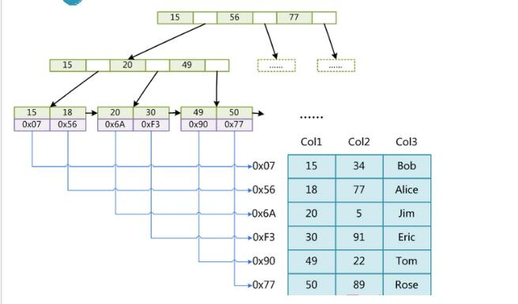
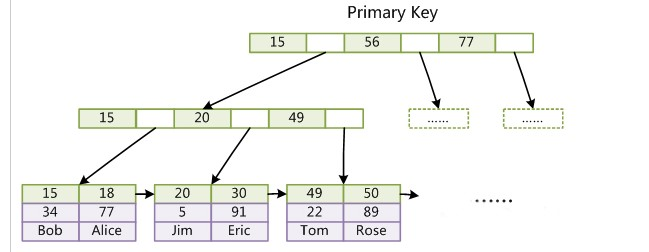

MyISAM非事务性引擎，提供告诉存储和检索，以及全文索引能力。在MyISAM中，一个table保存为三个文件：.frm 存储表定义，.myd 存储数据， .myi 存储索引。MyIASM中存储了表的行数。select count(*) from table时不需要全表扫描

InnoDB支持事务的引擎，提供了具有提交、回滚和崩溃回符能力的事务安全存储引擎。支持行锁，支持FOREIGN KEY

### MyISAM引擎的索引结构

MyISAM引擎的索引结构为**B+Tree**，其中B+Tree的**数据域存储的内容为实际数据的地址**，也就是说它的索引和实际的数据是分开的，只不过是用索引指向了实际的数据，这种索引就是所谓的**非聚集索引**

主索引和辅助索引（Secondary key）在结构上没有任何区别，只是主索引要求key是唯一的，而辅助索引的key可以重复。

### Innodb引擎的索引结构

　　与MyISAM引擎的索引结构同样也是B+Tree，但是Innodb的索引文件本身就是数据文件，即**B+Tree的数据域存储的就是实际的数据**，这种索引就是**聚集索引**。这个索引的key就是数据表的主键，因此InnoDB表数据文件本身就是主索引。

​	与MyISAM引擎的索引结构同样也是B+Tree，但是Innodb的索引文件本身就是数据文件，即**B+Tree的数据域存储的就是实际的数据**，这种索引就是**聚集索引**。这个索引的key就是数据表的主键，因此InnoDB表数据文件本身就是主索引。

　　并且和MyISAM不同，InnoDB的**辅助索引数据域存储的也是相应记录主键的值**而不是地址，所以当以辅助索引查找时，会先根据辅助索引找到主键，再根据主键索引找到实际的数据。所以Innodb不建议使用过长的主键，否则会使辅助索引变得过大。建议使用自增的字段作为主键，这样B+Tree的每一个结点都会被顺序的填满，而不会频繁的分裂调整，会有效的提升插入数据的效率。

​	第一个重大区别是InnoDB的数据文件本身就是索引文件。从上文知道，MyISAM索引文件和数据文件是分离的，索引文件仅保存数据记录的地址。而在InnoDB中，表数据文件本身就是按B+Tree组织的一个索引结构，这棵树的叶节点data域保存了完整的数据记录。这个索引的key是数据表的主键，因此InnoDB表数据文件本身就是主索引。

上图是InnoDB主索引（同时也是数据文件）的示意图，可以看到叶节点包含了完整的数据记录。这种索引叫做聚集索引。因为InnoDB的数据文件本身要按主键聚集，所以InnoDB要求表必须有主键（MyISAM可以没有），如果没有显式指定，则MySQL系统会自动选择一个可以唯一标识数据记录的列作为主键，如果不存在这种列，则MySQL自动为InnoDB表生成一个隐含字段作为主键，这个字段长度为6个字节，类型为长整形。

　第二个与MyISAM索引的不同是InnoDB的辅助索引data域存储相应记录主键的值而不是地址，助索引搜索需要检索两遍索引：首先检索辅助索引获得主键，然后用主键到主索引中检索获得记录

### 总结

了解不同存储引擎的索引实现方式对于正确使用和优化索引都非常有帮助，例如知道了InnoDB的索引实现后，就很容易明白为什么不建议使用过长的字段作为主键，因为所有辅助索引都引用主索引，过长的主索引会令辅助索引变得过大。再例如，用非单调(可能是指“非递增”的意思)的字段作为主键在InnoDB中不是个好主意，因为InnoDB数据文件本身是一颗B+Tree，非单调(可能是指“非递增”的意思)的主键会造成在插入新记录时数据文件为了维持B+Tree的特性而频繁的分裂调整，十分低效，而使用自增字段作为主键则是一个很好的选择。

