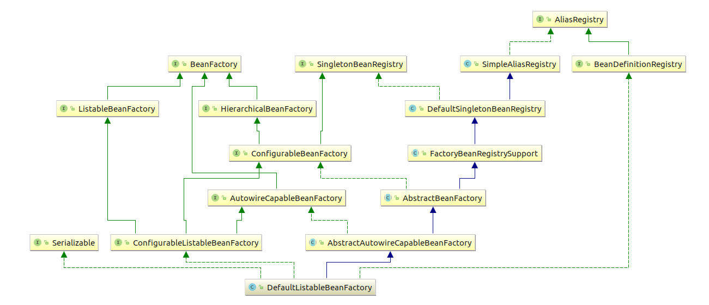
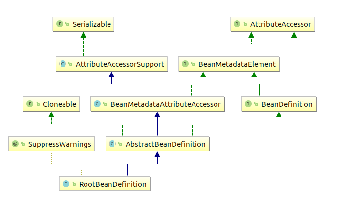

# Spring IOC

## 1 BeanFactory

Spring Bean的创建是典型的工厂模式，一切都是从BeanFactory开始的，这就是入口。



BeanFactory有三个子类： ListableBeanFactory，HierarchicalBeanFactory和AutowireCapableBeanFactory，最终实现类是DefaultListableBeanFactory 


对FactoryBean的转义定义，因为如果使用bean名字检索FactoryBean得到的对象是工厂生成的对象，如果需要得到工厂本身需要转义

```java
String FACTORY_BEAN_PREFIX = "&";
```

根据bean的名字，获取在IOC容器中得到的bean实例

```java
Object getBean(String name) throws BeansException;
```

根据bean的名字和Class类型来得到bean实例，增加了类型安全验证机制

```java
<T> T getBean(String name, Class<T> requiredType) throws BeansException;
```

提供对bean的检索，看看是否在IOC容器中有这个名字的bean

```java
boolean containsBean(String name);
```

根据bean名字得到bean实例，并同时判断这个bean是不是单例

```java
boolean isSingleton(String name) throws NoSuchBeanDefinitionException;
```

得到bean实例的Class类型

```java
Class<?> getType(String name) throws NoSuchBeanDefinitionException;
```

得到bean的别名，如果根据别名检索，那么其原名也会被检索出来

```java
String[] getAliases(String name);
```

ApplicationContext是spring提供的一个高级IOC容器，它除了提供IOC容器的基本功能外，还为用户提供了以下功能：

 	1. 支持信息源，可以实现国际化（实现MessageSource接口）
 	2. 访问资源。（实现ResourcePatternResolver接口）
 	3. 支持应用事件。（实现ApplicationEventPublisher接口）

## 2. BeanDefinition

Bean在spring中是以BeanDefinition来描述的



##  3. IOC容器初始化

IOC容器初始化包括BeanDefinition的Resource定位、载入和注册三个基本过程。

```java
//根据xml配置文件创建resource资源对象，该对象中包含了BeanDefinition的信息
ClassPathResource resource = new ClassPathResource("application-context.xml");
//创建DefaultListableBeanFactory
DefaultListableBeanFactory factory = new DefaultListableBeanFactory();
//创建XmlBeanDefinitionReader读取器，用于载入该对象中包含了BeanDefinition。
XmlBeanDefinitionReader reader = new XmlBeanDefinitionReader(factory);

reader.loadBeanDefinitions(resource);
```


